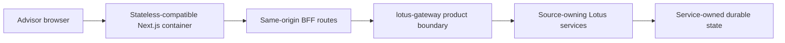

# Workbench Production Runtime And Support Boundary

## Decision status

- Status: accepted baseline; technology-risk certification remains incomplete
- Owner: `lotus-workbench`
- Governed issue: [#612](https://github.com/sgajbi/lotus-workbench/issues/612)
- Reviewed: 2026-09-16
- Next review: 2026-09-30
- Machine-readable policy:
  [`workbench-runtime-support-policy.v1.json`](workbench-runtime-support-policy.v1.json)

This decision records the implemented Workbench runtime boundary and the evidence that can be
claimed today. It is not a statement that a bank has certified the product, and it does not close
the wider dependency, licensing, browser, capacity, identity, availability, or disaster-recovery
work owned by #612.

## Decision

Workbench will use a conservative, supported web application stack with one exact build and CI
runtime, a minimal immutable production container, and a Gateway-first product boundary:

1. Node `22.23.1` and its bundled npm `10.9.8` are the exact CI and container build toolchain.
2. Developers may use the governed Node 22/npm 10 compatibility range; protected CI proves the
   exact release used to produce deployable evidence.
3. Next.js `15.5.25` remains temporarily accepted while it is in Maintenance LTS. Its support
   posture must be reviewed by 2026-09-30; a major upgrade requires its own compatibility evidence.
4. React `19.1.0` and TypeScript `5.9.3` remain exact-version application foundations.
5. The production image uses the digest-pinned official Debian Bookworm slim Node image, Next
   standalone output, the unprivileged `node` user, and no runtime package-manager toolchain.
6. Workbench owns interaction and presentation. Gateway and the source services continue to own
   financial calculations, persisted workflow state, permissions, and business decisions.
7. Browser automation is explicitly Chromium-only in this tranche. Framework browser floors and
   MDN Baseline are admission guidance, not substitutes for the future enterprise browser and
   assistive-technology matrix.

## Why this stack is retained

The 2026-09-16 bounded review rechecked the primary [Node release schedule](https://nodejs.org/en/about/previous-releases)
and [Next support policy](https://nextjs.org/support-policy). Node 22 and Next 15 remain supported
lines; no dependency or image was changed by this review. Full-graph and production moderate npm
audits passed with zero reported vulnerabilities. This renews the support review only, not the
independent browser, capacity, identity or bank certification claims below.

The current foundation is composed of mature, documented technologies with large engineering
ecosystems and supported release channels. Retaining it avoids novelty risk and an unnecessary
rewrite while allowing technology-risk evidence to be made deterministic.

That observation is not sufficient procurement evidence by itself. The versioned
[`workbench-dependency-risk-inventory.v1.json`](workbench-dependency-risk-inventory.v1.json) now
records license, stewardship, security channel, lifecycle, criticality, containment,
replaceability, and review ownership for every direct production dependency, including optional
installs and required peers. Its repository-owned validator uses the mature, development-only Ajv engine to
execute the complete JSON Schema and blocks unregistered, misclassified, or unsupported dependency
changes. Review evidence is assigned to the governed functional owner
`workbench-architecture-maintainers`, while HTTPS evidence must use a syntactically valid DNS name
or IP address. #612 remains open for independent bank architecture, cyber, legal, procurement,
accessibility, operations, and measured-scale review.

## Runtime topology and trust boundary

The browser may keep bounded interaction and query-cache state. It is not the authority for
portfolio calculations, entitlements, approvals, execution, or durable workflow state. Workbench
server routes proxy governed requests to Gateway and must fail closed when required source or
authority evidence is unavailable.

The standalone container does not intentionally own durable business state. This makes the
application tier compatible with replica-based deployment, but it does not prove horizontal-scale
capacity, high availability, failover, session behavior, or production identity. Those claims
require measured multi-replica and failure evidence after the production identity boundary exists.

## Reproducibility and supply-chain controls

The first #612 tranche enforces:

1. exact Node parity across protected workflows and the digest-pinned container;
2. exact npm and Playwright declarations with a lockfile-root runtime contract;
3. immutable `npm ci --no-audit --no-fund` installation, with security auditing retained as a
   separate fail-closed gate;
4. repository-locked Playwright CLI invocation and an explicit Chromium project;
5. exact Next, React, and TypeScript reconciliation against the versioned policy;
6. non-root container execution and exact base-image provenance;
7. parsed active GitHub workflow steps, named Docker-stage ownership, and the runner's final
   effective user, so comments, wrong-stage commands, and superseded directives cannot satisfy the
   control; and
8. a review-expiry check and explicit browser, capacity, horizontal-scale, and identity non-claims.

The existing protected lanes continue to enforce dependency audit, lint, strict TypeScript,
coverage, production build, browser smoke, Docker parity, production-image vulnerability scanning,
and CycloneDX SBOM generation.

## Support and upgrade rule

Production-critical framework or runtime changes require an issue-backed compatibility slice. The
slice must record the support or security reason, primary-source lifecycle evidence, focused
regressions, rollback posture, and exact-main proof. Beta, release-candidate, experimental, or
novelty-driven dependencies are not admitted to a production critical path without an explicit
technology-risk exception.

Node, npm, Next.js, browser floors, and the container digest must be reviewed no later than the
policy's `nextReviewBy` date. The repository gate fails after that date so lifecycle review cannot
silently become stale.

## Adopted And Rejected Enforcement Patterns

Adopted under [#616](https://github.com/sgajbi/lotus-workbench/issues/616):

1. parse workflow YAML into jobs and steps, then bind each exact Node selector and Playwright
   browser-install command to its active step;
2. declare the parser as an exact, lock-backed, development-only quality dependency rather than
   relying on its incidental presence below another tool;
3. read active Dockerfile instructions by named stage and evaluate the final `USER` directive in
   the production runner stage; and
4. preserve token adjacency when Docker escape continuations remove newlines, require the default
   backslash parser escape after normalizing Docker's supported leading UTF-8 BOM, consume `RUN` and
   `COPY` heredoc payloads without interpreting their contents as stage instructions, distinguish
   JSON-form operands from heredoc syntax through one shared parser, and reject
   `ONBUILD` triggers plus `SHELL` overrides throughout
   the governed stage chain; and
5. retain focused mutations for commented, missing, duplicate, wrong-stage, indirect,
   reinterpreted, and superseded proof.

Rejected:

1. global regular-expression counts or string-presence checks, because inactive comments and
   unrelated stages can satisfy them;
2. adding workflow or Docker parsing to the Workbench runtime bundle, because these controls belong
   only to development and CI; and
3. a broad new Docker parsing dependency for the bounded `FROM`, `RUN`, `USER`, `ONBUILD`, `SHELL`,
   and continuation invariants, which would enlarge the quality-tool supply chain without improving
   the governed evidence needed here.

## Evidence sources

1. [Node.js release lifecycle](https://nodejs.org/en/about/previous-releases)
2. [Node 22.23.1 archive and bundled npm version](https://nodejs.org/en/download/archive/v22.23.1)
3. [Next.js support policy](https://nextjs.org/support-policy)
4. [npm package metadata and `devEngines`](https://docs.npmjs.com/files/package.json/)
5. [Next.js supported browser floors](https://nextjs.org/docs/pages/getting-started/installation#supported-browsers)
6. [MDN Baseline compatibility scope](https://developer.mozilla.org/en-US/docs/Glossary/Baseline/Compatibility)
7. [GitHub Actions workflow syntax](https://docs.github.com/en/actions/reference/workflows-and-actions/workflow-syntax)
8. [Dockerfile instruction semantics](https://docs.docker.com/reference/dockerfile)
9. [Docker multi-stage build semantics](https://docs.docker.com/build/building/multi-stage/)

## Open certification work

The following remain open under #612 and must not be inferred from this decision:

1. independent legal and procurement approval of dependency licenses and third-party terms;
2. enterprise Edge, Firefox, Safari/WebKit, assistive-technology, and managed-browser evidence;
3. documented timeout, retry, cache, graceful-degradation, rollback, and observability decisions;
4. measured Workbench/Gateway load, soak, multi-replica, and failure-isolation evidence;
5. production identity, availability, disaster recovery, and bank architecture/procurement approval.
