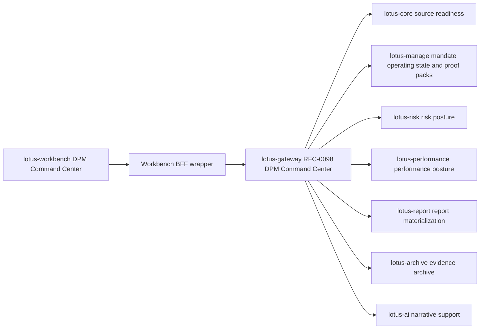
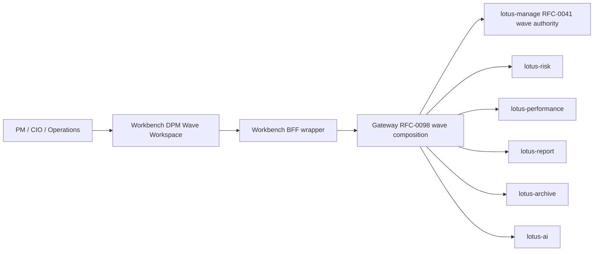
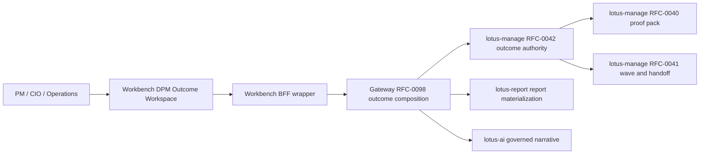
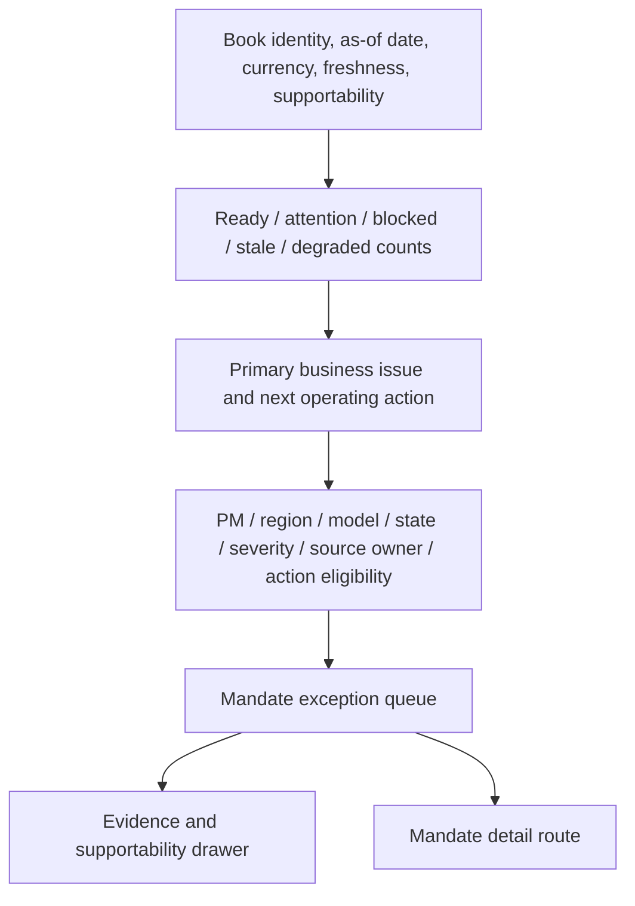
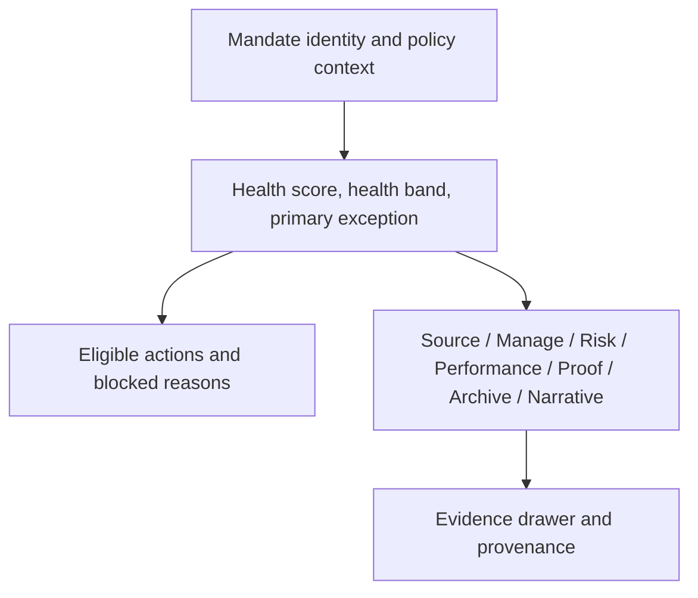

# RFC-0098: DPM Mandate Command Center Experience

| Metadata | Details |
| --- | --- |
| **Status** | IN PROGRESS — bounded command-center, construction, portfolio-memory, rebalance-wave, PM Copilot, operating-quality, outcome-review, and evidence-pack surfaces are implemented; fresh complete canonical certification remains open under Workbench #140 |
| **Created** | 2026-05-03 |
| **Last Tightened** | 2026-08-28 |
| **Owner** | `lotus-workbench` |
| **Primary Upstream Contract** | `lotus-gateway` RFC-0098 `DPM Command Center` |
| **Business Sponsor Persona** | DPM head, portfolio manager, CIO desk, investment control, operations, sales/pre-sales |
| **Depends On** | `lotus-gateway` RFC-0098, `lotus-manage` RFC-0037, `lotus-manage` RFC-0038, `lotus-manage` RFC-0040, `lotus-manage` RFC-0041, `lotus-manage` RFC-0042, `lotus-core` RFC-0087, Workbench RFC-0076/RFC-0077 canonical proof contracts |
| **Doc Location** | `docs/rfcs/RFC-0098-dpm-mandate-command-center-experience.md` |
| **Current Product Guide** | `wiki/Screen-Guide-Catalogue.md` and the linked Manage screen guides |

The implementation statements in this RFC describe bounded Workbench surfaces, not complete
canonical certification, production identity, execution, client delivery, or bank acceptance.
Historical branch and run notes below preserve delivery evidence from the time they were recorded;
GitHub issue #140 and current screen guides own present closure and capability truth.

RFC-0038 command-center cockpit live proof passed on 2026-05-06 with local Workbench and Gateway:
`output/rfc38-wtbd002-command-center-cockpit-command-center-validated/live-validation-summary.json`.
The run proved Gateway command-center summary and exceptions responses, populated DPM command-center
UI tables, and recorded the canonical `mandates/by-portfolio/PB_SG_GLOBAL_BAL_001` lookup as a
`seed_gap` (`DPM_MANDATE_NOT_FOUND`) owned by WTBD-003 canonical seed automation.

WTBD-003 populated seed automation was then completed locally on 2026-05-07 through
`lotus-platform` canonical front-office QA. The governed runtime now refreshes
`MANDATE_PB_SG_GLOBAL_BAL_001` from core through manage, runs a Manage monitoring pass, verifies
Gateway mandate lookup, health, and command-center summary, and classifies `dpm.command_center`
truthfully from Manage supportability. The current canonical source products now produce a populated
`READY` command center for the canonical PM/book/as-of filter. Workbench still preserves `seed_gap` for
non-populated environments, but the governed canonical portfolio path is no longer gap-coded.

RFC41-WTBD-006 implementation is now in progress on the
`wtbd-rfc41-workbench-wave-command-center` branch. The first Workbench wave command-center panel is
embedded in `/workbench/{portfolioId}` and consumes Gateway
`/api/v1/dpm/command-center/waves*` routes only. Promotion remains pending focused CI, canonical
front-office proof, PR merge, wiki publication, and Manage WTBD closure.

RFC40-WTBD-010 portfolio-memory product realization is implemented on
`/workbench/{portfolioId}`. The panel consumes Gateway
`GET /api/v1/dpm/command-center/portfolios/{portfolio_id}/memory`, renders manage-owned event
order, event types, source systems, source refs, artifact refs, reason codes, supportability, and
content hash, and does not reconstruct timeline nodes in the browser. Canonical live validation
accepts populated `READY`, `PARTIAL`, `DEGRADED`, and `BLOCKED` source truth because the panel is
responsible for surfacing source-owner readiness gaps; it still fails empty, unsupported,
unavailable, or content-hash-missing memory.

---

## 0. Executive Summary

`lotus-manage` RFC-0038 delivered the backend foundation for mandate digital twin, health scoring,
DPM operating state, stateful core-sourced management, and RFC-0040 proof-pack authority. Gateway
RFC-0098 defines the certified composition contract that brings core, manage proof-pack evidence,
RFC-0042 outcome-review evidence, risk, performance, report materialization, archive, and optional
AI posture together without
violating domain ownership.

This RFC defines the Workbench product experience that realizes the business outcome: a
private-banking-grade discretionary portfolio management command center.

The command center is not a generic analytics dashboard. It is a daily operating cockpit for
portfolio managers and investment control teams:

1. what needs attention,
2. why it needs attention,
3. who owns remediation,
4. what action is safe,
5. what evidence supports the decision,
6. what can be shown in a credible client or sales demo.

Workbench must consume Gateway truth only. It must not stitch raw domain services together and must
not invent unsupported readiness, action, risk, performance, or proof-pack states.

---

## 1. Gold-Standard Tightening Review

This review records the changes made before implementation to turn the first draft into an execution
guide.

| Area | First-draft weakness | Tightened requirement |
| --- | --- | --- |
| Business outcome | Strong intent but not sufficiently measurable by persona. | Added PM, CIO, operations, sales/demo, and audit outcomes with route-level proof. |
| Gateway dependency | Gateway-first was stated, but not strict enough. | Workbench must consume only Gateway RFC-0098 command-center routes; direct raw domain-service calls are forbidden. |
| Screen design | Layout was directionally correct but lacked detailed screen anatomy. | Added book view, mandate detail, action rail, evidence drawer, module states, and route responsibilities. |
| State handling | States existed but were not mapped to UI behavior and blocked actions in enough detail. | Added complete ready/attention/degraded/blocked/stale/not-supported/not-requested/unavailable/error handling. |
| Testing | Testing strategy was useful but too broad. | Added unit, integration, browser, live, visual, accessibility, observability, and evidence package gates. |
| Documentation | Docs were listed but not audience-specific. | Added business, engineering, operations, sales/pre-sales, marketing, and client-demo documentation expectations. |
| Slices | Missing the full Lotus delivery slices. | Added platform/scaffolding, cleanup, implementation proof, second-last hardening, and final closure slices. |
| Proof boundary | Needed clearer separation between backend proof and UI proof. | UI supported-feature promotion requires Gateway-ready contract plus canonical browser evidence. |

Implementation must not begin until Gateway RFC-0098 is accepted as the upstream contract and this
RFC maps every visible Workbench state to fields in that contract.

---

## 2. Business Outcomes

The command center must deliver these business outcomes:

1. **Portfolio manager control of the DPM book**
   PMs can start the day with a prioritized view of mandates that are ready, drifting, blocked,
   stale, degraded, underperforming, or awaiting action.
2. **Institutional mandate governance**
   Every visible exception is tied to mandate policy, model portfolio, risk posture, performance
   posture, source readiness, proof-pack state, or workflow evidence.
3. **Faster action with less operational noise**
   PMs can move from issue detection to simulation, proof-pack generation, deferral, or escalation
   without manually checking multiple systems.
4. **CIO and investment-control oversight**
   CIO teams can see model-level drift, mandate concentration of issues, and action readiness across
   the book.
5. **Operations-grade supportability**
   Operations can identify whether a bad state is caused by source data, analytics calculation,
   archive/report readiness, entitlement, or manage workflow state.
6. **Audit-ready decision trail**
   Actions, evidence refs, source systems, supportability states, and action outcomes are visible
   without exposing sensitive raw payloads.
7. **Client-demo and sales credibility**
   Sales, pre-sales, and client-demo users can explain how Lotus monitors discretionary mandates,
   protects client objectives, and links action to evidence.

---

## 3. Problem Statement

Workbench currently has strong Portfolio, Performance, Risk, advisor-brief, reporting, archive, and
data-product surfaces. It does not yet realize the DPM business journey as one coherent command
center.

The user should not have to understand service topology to answer:

1. Which mandates need attention today?
2. Which issue is most severe and why?
3. Is the portfolio ready to rebalance or blocked by source data?
4. Is the mandate drifting from the model?
5. Is risk or performance posture driving the review?
6. Is there a proof pack or report ready for governance review?
7. Which action is safe now?
8. Which source system owns the degraded state?

The command center must make these answers visible while preserving Gateway and domain-service
truth. Workbench is the product experience layer; it is not a domain authority.

---

## 4. Goals and Non-Goals

### 4.1 Goals

1. Add a first-class DPM command-center product surface.
2. Consume Gateway RFC-0098 and no raw domain services.
3. Render book-level mandate oversight and single-mandate detail.
4. Render source readiness, mandate operating state, risk posture, performance posture,
   proof-pack evidence, reporting, evidence archive, and optional narrative support.
5. Gate all actions through Gateway-provided eligibility.
6. Provide evidence drawer and supportability behavior for business and operations users.
7. Prove the surface with canonical `PB_SG_GLOBAL_BAL_001` live validation and screenshot evidence.
8. Produce polished README/wiki/demo material after implementation.

### 4.2 Non-Goals

1. Workbench does not call `lotus-core`, `lotus-manage`, `lotus-risk`, `lotus-performance`,
   `lotus-report`, `lotus-archive`, or `lotus-ai` directly for this product surface.
2. Workbench does not calculate mandate health, risk, performance, or proof-pack state.
3. Workbench does not invent actions not returned by Gateway.
4. Workbench does not promote target-state DPM capability as supported until live proof exists.
5. Workbench does not build a decorative command-center landing page. The first screen is the
   usable operating cockpit.

---

## 5. Product Principles

1. **Gateway-first**
   Workbench consumes Gateway RFC-0098 routes through the Workbench BFF only.
2. **Exception-first**
   The first screen prioritizes readiness, severity, business impact, and next action.
3. **Evidence always available**
   Every material state has a source, freshness, supportability, and evidence path.
4. **No fake readiness**
   Empty, partial, blocked, stale, degraded, not-supported, unavailable, and error states are
   explicit.
5. **PM workflow before service topology**
   The UI reads like a DPM operating cockpit, not a stitched service dashboard.
6. **Enterprise density**
   Information is dense, aligned, scannable, and domain-labeled, without decorative spectacle.
7. **Demo-grade and operations-grade**
   The same surface supports credible client demos and real support triage.

---

## 6. Architecture Direction

Workbench may add BFF wrappers for Next.js ergonomics, but BFF wrappers must preserve Gateway truth.
They must not reshape domain states into unsupported UI states.

---

## 7. Gateway Contract Consumption

### 7.0 Construction Alternatives Lab Addendum

Workbench RFC-0098 must include a DPM construction alternatives lab once Gateway exposes the
construction module backed by `lotus-manage` RFC-0039. This belongs inside the command-center
experience because the portfolio manager reaches construction alternatives from mandate attention,
rebalance readiness, and action posture. It must not become a separate decorative optimizer page.

### 7.1 Portfolio Memory Timeline Addendum

Workbench RFC-0098 must include a portfolio-memory timeline panel once Gateway exposes the
manage-owned RFC40-WTBD-010 route. The panel is the product-readable event trail across RFC-0040
proof packs, RFC-0041 waves and handoffs, and RFC-0042 outcome reviews.

The implemented panel:

1. consumes only Gateway
   `GET /api/v1/dpm/command-center/portfolios/{portfolio_id}/memory`,
2. consumes only Gateway `GET /api/v1/dpm/command-center/portfolio-memory/search` for bounded
   Manage-local source-family posture over persisted memory lineage,
3. renders manage-owned supportability state, event count, event type counts, source systems,
   source-system/source-type facets, support boundary, reason codes, and content hash,
4. preserves upstream event order, event type, event time, source refs, artifact refs, and reason
   codes,
5. shows empty, partial, degraded, unsupported, unavailable, and error states explicitly,
6. emits bounded `dpm.portfolio-memory.get` and `dpm.portfolio-memory.search` observability without
   portfolio ids, event ids, source ids, content hashes, source refs, request payloads, response
   payloads, or screen content as metric labels,
7. must not call `lotus-manage` directly,
8. must not reconstruct timeline nodes from proof-pack, wave, outcome-review, report, archive, or
   AI responses,
9. must not query source-owner stores, discover the global portfolio universe, run cross-app
   source-event search, or claim OMS execution, fills, settlement, or client communication
   workflow.

This panel is intentionally read-only in the current slice. Dedicated timeline filters, event
detail drawers, retention/audit policy controls, cross-app lifecycle export, and client-demo
timeline scripts remain follow-up scope until the owning services and Workbench browser proof
promote them.

Business outcome:

1. PMs compare `do nothing`, explainable rebalance, minimum-turnover, and tax-aware choices before
   selecting an action path,
2. CIO and investment-control users inspect objective and constraint evidence before approval,
3. tax and operations users understand why turnover, tax, liquidity, source readiness, or
   supportability affects a construction choice,
4. sales/pre-sales can demonstrate institutional-grade portfolio construction with visible
   trade-offs and evidence.

Workbench must consume Gateway only. It must not call `lotus-manage` directly and must not run
optimizer logic or construction-method rules in the browser.

Required construction lab panels:

| Panel | Purpose | Required behavior |
| --- | --- | --- |
| Alternative Set Header | Show portfolio, mandate, as-of, supportability, and generation state. | Keep `alternative_set_id`, method count, generated timestamp, source posture, and downstream action posture visible. |
| Comparison Matrix | Let PM compare construction alternatives. | Display method, status, drift before/after, drift reduction, turnover, trade count, estimated cost, cash impact, and supportability. |
| Objective And Constraint Trace | Explain why each alternative exists or is constrained. | Render bounded objective terms, constraint statuses, reason codes, and source family without raw payloads. |
| Trade Intent Preview | Show business impact without executing orders. | Render trade count and intent identifiers as preview evidence; do not expose unsupported order execution affordances. |
| Selection Drawer | Capture PM rationale. | Submit selected alternative id, actor, bounded reason code, optional comment, and correlation id through Gateway. |
| Evidence Drawer | Support audit, operations, and demo storytelling. | Show source supportability, lineage, degraded reason codes, and canonical proof refs where Gateway provides them. |

Required UI states:

1. no alternatives generated,
2. generation in progress,
3. ready alternatives,
4. partial or degraded supportability,
5. pending-review alternative,
6. blocked or infeasible alternative,
7. selected alternative,
8. selection saved,
9. selection failed with a bounded error,
10. downstream action unavailable because Gateway/Manage says it is not supported.

Canonical proof must use `PB_SG_GLOBAL_BAL_001` and show a meaningful comparison:

1. do-nothing preserves drift with zero turnover,
2. explainable heuristic reduces drift with visible trade intents,
3. minimum-turnover shows review-required behavior when turnover budget suppresses intents,
4. tax-aware posture carries explicit supportability/degraded reason codes until all authoritative
   enrichment is available,
5. selected alternative persists and remains visible after reload.

The UI must reserve product claims carefully: manage backend construction alternatives are
supported after RFC-0039 proof, but Workbench construction lab support is not supported until
Gateway RFC-0098 implementation, browser validation, screenshot evidence, accessibility checks,
and canonical front-office live proof pass.

Implementation note as of 2026-05-06: the first RFC-0039 construction-lab realization is embedded
in `/workbench/{portfolioId}` using Gateway
`/api/v1/dpm/command-center/construction/alternative-sets*`. Workbench sends a stateful manage/core
source selector through Gateway, displays manage-owned alternative ids, methods, method statuses,
comparison metrics, supportability, objective/constraint trace counts, and selected-alternative
state, and records selection through Gateway. It does not build stateless source snapshots, prices,
optimizer results, source readiness, or selection truth in browser code. Dedicated `/dpm`
command-center routes, richer drawers, and canonical demo promotion remain gated until final live
proof, visual review, accessibility review, and wiki/support wording are complete.

### 7.0A Proof-Pack Review Workspace Addendum

Workbench RFC-0098 must include a proof-pack review workspace once Gateway exposes the
`proof_pack_evidence` module backed by `lotus-manage` RFC-0040. This workspace belongs inside the
DPM command center because proof packs explain why a discretionary action is proposed and whether
the evidence is ready for PM, compliance, operations, and audit review.

Workbench must consume Gateway only. It must not call `lotus-manage`, `lotus-report`, or
`lotus-ai` directly for this surface, must not rebuild proof-pack sections, and must not generate
proof-pack hashes, report inputs, AI evidence inputs, PM memos, or report outputs in browser code.

Required proof-pack panels:

| Panel | Purpose | Required behavior |
| --- | --- | --- |
| Proof-Pack Header | Show portfolio, mandate, as-of, proof-pack id, status, content hash, and generation posture. | Keep proof-pack identity and immutable hash visible when Gateway provides them. |
| Section Matrix | Let PM, compliance, and operations scan evidence readiness. | Render section states, titles, summaries, reason codes, and remediation owner without changing supportability truth. |
| Markdown Preview | Provide a business-readable proof-pack summary. | Render Gateway-provided Markdown only; do not synthesize narrative locally. |
| Evidence Drawer | Support audit and operations review. | Show lineage refs, source hashes, generated report-input ref, AI-evidence ref, support reference, and unavailable/degraded reasons. |
| Report/AI Handoff Rail | Show downstream materialization readiness. | Distinguish manage report-input and AI-evidence readiness from `lotus-report` report output and `lotus-ai` memo workflow-pack state. Request PM memo generation through Gateway only. |

Required UI states:

1. no proof pack generated,
2. proof-pack generation available,
3. generation blocked by source readiness or entitlement,
4. proof pack ready,
5. proof pack degraded or pending review,
6. proof pack blocked,
7. report-input ready but report output unavailable,
8. AI-evidence ready but AI memo unavailable, including AI PM memo unavailable or waiting for review,
9. Gateway or manage unavailable.

Supported-feature promotion is forbidden until Gateway implementation, Workbench browser proof,
canonical screenshots, accessibility checks, and live validation pass.

Implementation note as of 2026-05-07: the first RFC-0040 proof-pack review realization is embedded
in `/workbench/{portfolioId}` using Gateway `/api/v1/dpm/command-center/proof-packs*`.
Workbench derives the launch context from Gateway outcome-review rebalance-run references and can
trigger Gateway proof-pack generation for the linked run. The generation source is the manage
rebalance run surfaced by the Gateway Workbench rebalance snapshot, not an RFC-0042
expected-snapshot run id. Outcome-review proof ids such as RFC-0042 `dpp_*` references are not
treated as RFC-0040 proof-pack ids. Workbench renders
Gateway/manage proof-pack identity, status, content hash, section states, source hashes, Markdown
availability, report-input readiness, AI-evidence readiness, and lotus-ai PM memo workflow-pack
posture only after Gateway returns the generated proof-pack payload or memo handoff response.
Browser code does not rebuild proof-pack sections, compute hashes, synthesize Markdown, construct
report input, construct AI evidence, construct PM memo prompts, materialize reports, or call
`lotus-manage`, `lotus-report`, or `lotus-ai` directly. The live canonical
validator now generates an RFC-0040 proof pack from the Gateway Workbench rebalance snapshot before
registering the `dpm.proof_pack` panel against the governed Workbench panel registry.
Populated proof packs with manage business state `PENDING_REVIEW` or `DEGRADED` are valid product
evidence when they include proof-pack identity, reviewable sections, source hashes or lineage, and
handoff posture; Workbench must preserve that business state instead of relabelling it as fully
ready.

### 7.0B Rebalance Wave Command Center Addendum

Workbench RFC-0098 must include a rebalance-wave command-center workspace once Gateway exposes the
RFC-0041 wave composition family backed by `lotus-manage`. This workspace belongs inside the DPM
command center because waves are the operating container for affected portfolios, source checks,
construction alternatives, proof-pack linkage, approval, staging, and internal operations handoff.

Workbench must consume Gateway only. It must not call `lotus-manage` directly, must not calculate
source readiness, aggregate metrics, construction alternatives, proof-pack state, action
eligibility, supportability, or handoff posture, and must not imply external execution from manage
handoff refs.

Target user journey:

1. PM or CIO opens the DPM wave command-center view from `/dpm`.
2. The user previews or opens a wave backed by a Gateway route under
   `/api/v1/dpm/command-center/waves`.
3. Workbench renders mixed readiness across ready, degraded, blocked, simulated, selected,
   proof-pack-ready, approved, staged, and handoff-ready items.
4. Workbench enables only Gateway-returned actions and shows disabled reasons for every blocked
   source-check, simulate, select, approve, stage, or handoff action.
5. Operations opens the supportability drawer and sees support refs, source owner, reason codes,
   and remediation route without portfolio/client identifiers or raw payloads.
6. Sales/pre-sales can demonstrate candidate selection through internal handoff, while clearly
   stating that external execution is not claimed by manage or Workbench.

Required wave panels:

| Panel | Purpose | Required behavior |
| --- | --- | --- |
| Wave Header | Show wave identity, trigger, as-of date, state, version, item counts, and supportability. | Preserve Gateway/manage state names and display `external_execution_claimed=false` when handoff refs are shown. |
| Item Matrix | Let PM, CIO, and operations scan mixed item readiness. | Render item state, reason codes, selected alternative refs, proof-pack refs, and product-safe diagnostics from Gateway only. |
| Action Rail | Guide source-check, simulate, select, approve, stage, and handoff progression. | Buttons are enabled only from Gateway `action_eligibility`; disabled reasons remain visible and auditable. |
| Construction Drawer | Compare generated alternatives for eligible items. | Render Gateway construction module data; never run optimization or infer selection locally. |
| Proof-Pack Evidence Drawer | Explain selected item evidence. | Link proof-pack id, section posture, content hash, Markdown/report/AI input posture, and degraded reasons when Gateway provides them. |
| Supportability Drawer | Support operator triage. | Show support refs, source owners, remediation routes, and safe diagnostics; hide portfolio/client/raw request/trace details. |
| Operations Handoff Rail | Show internal staging and handoff posture. | Render staged and handoff-ready refs as internal evidence only; do not expose unsupported execution controls. |

Required UI states:

1. no wave selected,
2. preview available but not durable,
3. created wave awaiting source check,
4. source-checked wave with mixed ready/degraded/blocked items,
5. simulation in progress,
6. simulated or partially simulated wave,
7. alternative selection required,
8. proof-pack pending or degraded,
9. approval available or approval blocked,
10. approved with exceptions,
11. staged,
12. handoff-ready with internal handoff evidence,
13. Gateway unavailable,
14. manage wave authority unavailable,
15. supportability blocked/degraded/not found.

Workbench must consume these Gateway wave routes when implemented:

| Gateway endpoint | Workbench route/use |
| --- | --- |
| `GET /api/v1/dpm/command-center/waves` | `/dpm/waves` list or embedded wave rail |
| `GET /api/v1/dpm/command-center/waves/{wave_id}` | `/dpm/waves/[waveId]` detail workspace |
| `GET /api/v1/dpm/command-center/waves/{wave_id}/supportability` | supportability drawer |
| `POST /api/v1/dpm/command-center/waves/preview` | non-durable preview workflow |
| `POST /api/v1/dpm/command-center/waves` | durable wave creation |
| `POST /api/v1/dpm/command-center/waves/{wave_id}/source-check` | source-check action |
| `POST /api/v1/dpm/command-center/waves/{wave_id}/simulate` | construction simulation action |
| `POST /api/v1/dpm/command-center/waves/{wave_id}/items/{wave_item_id}/select` | alternative selection drawer |
| `POST /api/v1/dpm/command-center/waves/{wave_id}/approve` | approval action |
| `POST /api/v1/dpm/command-center/waves/{wave_id}/stage` | staging action |
| `POST /api/v1/dpm/command-center/waves/{wave_id}/handoff` | internal operations handoff action |
| `GET /api/v1/dpm/command-center/waves/{wave_id}/report-input` | report-input evidence drawer |
| `POST /api/v1/dpm/command-center/waves/{wave_id}/ai-pm-memo` | governed AI PM memo request |
| `POST /api/v1/dpm/command-center/waves/{wave_id}/operations-handoff-summary` | governed operations handoff summary request |
| `GET /api/v1/dpm/command-center/waves/campaign-definitions` | Manage-owned bulk-review campaign definitions |
| `GET /api/v1/dpm/command-center/waves/campaign-operating-queue` | read-only Manage campaign operating queue summary |
| `GET /api/v1/dpm/command-center/waves/campaign-approval-inbox` | read-only Manage campaign approval inbox summary |
| `GET /api/v1/dpm/command-center/waves/campaign-workflow-board` | read-only Manage campaign workflow board summary |
| `GET /api/v1/dpm/command-center/waves/campaign-assignment-plan` | read-only Manage campaign assignment plan summary |
| `GET /api/v1/dpm/command-center/waves/campaign-workflow-automation` | read-only Manage workflow automation posture |
| `GET /api/v1/dpm/command-center/waves/campaign-definitions/{campaign_id}/versions/{campaign_version}/lifecycle-events` | Manage lifecycle evidence for a selected campaign definition |
| `POST /api/v1/dpm/command-center/waves/campaign-definitions/{campaign_id}/versions/{campaign_version}/retire` | bounded Gateway-backed campaign-definition retire control |
| `POST /api/v1/dpm/command-center/waves/campaign-definitions/{campaign_id}/versions/{campaign_version}/supersede` | bounded Gateway-backed campaign-definition supersede control |
| `GET /api/v1/dpm/command-center/waves/campaign-definitions/{campaign_id}/versions/{campaign_version}/launch-history` | paged append-only `BulkReviewCampaignDefinitionLaunchHistory:v1` audit posture for a selected campaign definition |
| `GET /api/v1/dpm/command-center/waves/campaign-definitions/{campaign_id}/versions/{campaign_version}/preview-readiness` | Manage-owned `BulkReviewCampaignDefinitionPreviewReadiness:v1` posture for selected campaign preview and wave-create readiness |
| `GET /api/v1/dpm/command-center/waves/campaign-definitions/{campaign_id}/versions/{campaign_version}/launch-package` | Manage-owned launch readiness and idempotency evidence for a selected campaign definition |
| `POST /api/v1/dpm/command-center/waves/campaign-definitions/{campaign_id}/versions/{campaign_version}/launch` | READY-gated durable campaign launch through Gateway |
| `GET/POST /api/v1/dpm/command-center/waves/campaign-definitions/{campaign_id}/versions/{campaign_version}/approval-decisions` | approval-decision evidence list and bounded Gateway-backed record control |
| `GET/POST /api/v1/dpm/command-center/waves/campaign-definitions/{campaign_id}/versions/{campaign_version}/assignment-actions` | assignment-action evidence list and bounded Gateway-backed record control |
| `GET/POST /api/v1/dpm/command-center/waves/campaign-definitions/{campaign_id}/versions/{campaign_version}/assignment-tasks` | assignment-task evidence list and bounded Gateway-backed record control |
| `POST /api/v1/dpm/command-center/waves/campaign-definitions/{campaign_id}/versions/{campaign_version}/assignment-tasks/{task_ref}/transitions` | bounded Gateway-backed assignment-task transition evidence record control |
| `GET/POST /api/v1/dpm/command-center/waves/campaign-definitions/{campaign_id}/versions/{campaign_version}/maker-checker-controls` | maker-checker evidence list and bounded Gateway-backed record control |

Implementation note as of 2026-05-14: the first RFC-0041 rebalance-wave command-center
realization is embedded in `/workbench/{portfolioId}` through Gateway
`/api/v1/dpm/command-center/waves*`. Workbench loads the explicit portfolio-list wave queue,
previews and creates canonical portfolio waves, opens wave detail and item posture, and calls
source-check, simulation, approval, staging, handoff, proof-posture, supportability, report-input,
governed AI PM memo, and governed operations-handoff summary requests through the Workbench
BFF/Gateway boundary. It also loads active Manage-owned `BulkReviewCampaignDefinition:v1`
campaign definitions through Gateway
`GET /api/v1/dpm/command-center/waves/campaign-definitions` and renders campaign name, version,
status, as-of date, candidate count, eligible portfolio type, governance posture, and source-backed
posture without rendering campaign content hashes or recalculating membership. For the selected
campaign, Workbench now renders a candidate-source review card with source product, source-owned
selection basis when supplied by Gateway/Manage, readiness, applied filters, warnings, lineage-ref
count, next action, and explicit no-OMS/no-client-contact boundaries. This is display-only
Gateway-backed posture; Workbench does not discover campaign
cohorts, page through source-owner stores, or calculate membership locally. The panel can open
selected campaign lifecycle evidence through Gateway
`GET /api/v1/dpm/command-center/waves/campaign-definitions/{campaign_id}/versions/{campaign_version}/lifecycle-events`
and record bounded retire/supersede lifecycle commands through Gateway
`POST /api/v1/dpm/command-center/waves/campaign-definitions/{campaign_id}/versions/{campaign_version}/retire`
and
`POST /api/v1/dpm/command-center/waves/campaign-definitions/{campaign_id}/versions/{campaign_version}/supersede`.
Those controls require actor and reason evidence, require replacement version/hash evidence for
supersede, refresh campaign definitions and lifecycle evidence after accepted commands, and render
returned status, actor, reason, replacement lineage, correlation id, content hash, reason codes,
and operating boundaries without fabricating browser-owned lifecycle truth. The panel can also open
append-only launch history through Gateway
`GET /api/v1/dpm/command-center/waves/campaign-definitions/{campaign_id}/versions/{campaign_version}/launch-history`,
including Manage-recorded wave id, launched-at time, launched-by actor, requested as-of date,
correlation id, idempotency key, count, total count, limit, offset, and operating boundaries
without inferring campaign lifecycle state, recomputing launch state, recalculating membership,
or operating unsupported lifecycle commands locally. It checks campaign preview readiness through Gateway
`GET /api/v1/dpm/command-center/waves/campaign-definitions/{campaign_id}/versions/{campaign_version}/preview-readiness`
and renders Manage-owned supportability, reason codes, blocked actions, source references, and
operating boundaries without recalculating readiness. It then checks launch-package readiness through Gateway
`GET /api/v1/dpm/command-center/waves/campaign-definitions/{campaign_id}/versions/{campaign_version}/launch-package`
and exposes campaign launch through Gateway
`POST /api/v1/dpm/command-center/waves/campaign-definitions/{campaign_id}/versions/{campaign_version}/launch`
only when Manage returns `READY`, preserving durable wave response and idempotency evidence without
recomputing membership, launch readiness, idempotency, maker-checker workflow, trade approval,
staging, or OMS execution locally. It also renders campaign workflow audit posture from Gateway
operating queue, approval inbox, workflow board, assignment plan, workflow automation,
approval-decision, assignment-action, assignment-task, and maker-checker reads, preserving
source refs, count/page metadata, reason codes, content hashes, task-transition posture, and
operating boundaries. Selected-campaign workflow controls can record bounded Gateway-backed
approval-decision, assignment-action, assignment-task, assignment-task transition, and
maker-checker-control evidence, then refresh the source-owned evidence lists and show
Gateway-returned correlation, source, upstream-status, content-hash, reason-code, and boundary
evidence without fabricating browser-owned workflow state. The panel renders
manage-owned wave id, lifecycle state, item count, issue count, supportability reason codes,
blocked actions, aggregate metrics, item states, source-readiness state, alternative refs,
report-input refs, proof-pack refs, handoff refs, lotus-ai workflow-pack run posture, and
`external_execution_claimed` posture without direct `lotus-manage` or `lotus-ai` calls,
client-side readiness calculation, report-input construction, prompt construction, local memo
narrative generation, local operations handoff-summary generation, campaign discovery, campaign
membership calculation, maker-checker workflow, trade approval, staging, or OMS execution claims.
Item-selection drawers, richer supportability drawers, dedicated
`/dpm/waves` routes, PM-book discovery, global campaign discovery, campaign-definition upsert UX,
CIO approval workflow, and external OMS execution remain future scope until Gateway/Manage and
Workbench proof promote them.

Supported-feature promotion is forbidden until the Workbench BFF and browser implementation is
complete, canonical `PB_SG_GLOBAL_BAL_001` live validation passes, visual and accessibility
evidence is captured, screenshots are reviewed for layout/state correctness, and the
wiki/supported-feature material is updated with implementation-backed wording.

### 7.0C Post-Trade Outcome Review Workspace Addendum

Workbench RFC-0098 must include a post-trade outcome-review workspace once Gateway exposes the
RFC-0042 outcome-review composition family backed by `lotus-manage`. This workspace closes the DPM
loop after construction, proof-pack generation, wave approval, staging, and internal handoff.

Workbench must consume Gateway only. It must not call `lotus-manage`, `lotus-core`, `lotus-risk`,
`lotus-performance`, `lotus-report`, `lotus-archive`, or `lotus-ai` directly for this surface. It
must not recompute expected values, realized values, variance, tolerance, dimension state, source
freshness, supportability, report-input posture, or AI-evidence posture.

Implementation note as of 2026-05-05: the first RFC-0042 outcome-review realization is embedded in
`/workbench/{portfolioId}` using Gateway
`GET /api/v1/dpm/command-center/outcome-reviews`. It includes typed Workbench API wrappers,
bounded analytics UI observability surfaces, deterministic view-model normalization, and a
portfolio-linked panel that renders manage-owned review state, dimension rows, lineage rows,
snapshot hashes, supportability reasons, blocked actions, report handoff posture, and
Gateway-backed governed AI narrative request posture. Workbench now also renders Manage-published
applied source-lineage filters, source-owner counts, source-type counts, and support boundary in a
read-only posture. Workbench does not call `lotus-ai` or
construct prompts; the narrative action uses Gateway
`POST /api/v1/dpm/command-center/outcome-reviews/{outcome_review_id}/ai-narrative`, which composes
manage-owned AI evidence with `lotus-ai` workflow-pack execution. Dedicated `/dpm/outcomes`
routing, preview/create/source-refresh mutations, drawers, and canonical live screenshot proof
remain future RFC-0098 command-center work unless separately promoted by implementation evidence.

Target user journey:

1. PM opens the DPM outcome workspace from `/dpm` or a wave/proof-pack link.
2. The user searches or opens an outcome review backed by Gateway routes under
   `/api/v1/dpm/command-center/outcome-reviews`.
3. Workbench renders expected-versus-realized dimensions across ready, pending-review, breached,
   degraded, blocked, and not-supported states.
4. Workbench shows source lineage, source-owner families, source hashes, freshness, reason codes,
   and remediation routes from Gateway/manage truth only.
5. Operations opens the supportability drawer and sees dimension counts, source-owner families,
   freshness counts, support refs, and remediation routes without raw source payloads.
6. Sales/pre-sales can demonstrate a closed-loop outcome story while clearly stating that report
   rendering/archive artifacts, external execution, PM scoring, and autonomous AI recommendations
   are not claimed unless the owning apps have implemented and proven them. The implemented AI
   narrative action is a governed Gateway/AI workflow-pack request over manage-owned evidence, not
   an approval, client contact, or PM score.

Required outcome panels:

| Panel | Purpose | Required behavior |
| --- | --- | --- |
| Outcome Header | Show review id, portfolio, mandate, review window, run, proof-pack, wave, state, and reason codes. | Preserve Gateway/manage names and never infer state from local UI rules. |
| Dimension Matrix | Compare expected versus realized outcome dimensions. | Render expected, realized, variance, tolerance, state, source freshness, and reason codes from Gateway only. |
| Source Lineage Drawer | Support audit and operations. | Show source owners, source refs, hashes, timestamps, freshness, and supportability without raw payloads. |
| Supportability Drawer | Support operator triage. | Show dimension counts, source-owner families, freshness counts, remediation routes, and safe diagnostics. |
| Report Input Panel | Explain downstream report readiness. | Show report-input availability only; do not imply rendered report or archive completion. |
| AI Evidence Panel | Explain downstream AI readiness. | Show AI-evidence permitted use and forbidden actions only; request governed narrative execution through Gateway only and show bounded run status. Do not generate prompts, autonomous recommendations, approvals, or PM scores. |
| Action Rail | Guide preview, create, source refresh, and handoff reads. | Buttons are enabled only from Gateway action eligibility; unsupported report, AI, archive, execution, and PM-scoring actions remain disabled or absent. |

Required UI states:

1. no outcome review selected,
2. preview available but not durable,
3. created review ready,
4. pending review due soft-tolerance variance,
5. breached hard tolerance,
6. degraded source evidence,
7. blocked mandatory source evidence,
8. not-supported dimension,
9. source refresh available,
10. report input available but rendered report unavailable,
11. AI evidence available and governed AI narrative request available,
12. Gateway unavailable,
13. manage outcome authority unavailable,
14. supportability blocked/degraded/not found.

Workbench must consume these Gateway outcome routes when implemented:

| Gateway endpoint | Workbench route/use |
| --- | --- |
| `GET /api/v1/dpm/command-center/outcome-reviews` | `/dpm/outcomes` list or embedded outcome rail |
| `GET /api/v1/dpm/command-center/outcome-reviews/{outcome_review_id}` | `/dpm/outcomes/[outcomeReviewId]` detail workspace |
| `GET /api/v1/dpm/command-center/outcome-reviews/{outcome_review_id}/supportability` | supportability drawer |
| `GET /api/v1/dpm/command-center/outcome-reviews/{outcome_review_id}/report-input` | report-input panel |
| `GET /api/v1/dpm/command-center/outcome-reviews/{outcome_review_id}/ai-evidence-input` | AI-evidence panel |
| `POST /api/v1/dpm/command-center/outcome-reviews/{outcome_review_id}/ai-narrative` | governed AI narrative action from embedded outcome panel |
| `POST /api/v1/dpm/command-center/outcome-reviews/preview` | non-durable preview workflow |
| `POST /api/v1/dpm/command-center/outcome-reviews` | durable outcome-review creation |
| `POST /api/v1/dpm/command-center/outcome-reviews/{outcome_review_id}/refresh-sources` | source refresh action |

Supported-feature promotion for the embedded `/workbench/{portfolioId}` outcome-review panel now
requires canonical `PB_SG_GLOBAL_BAL_001` live validation, visual and accessibility evidence,
screenshots reviewed for outcome-state correctness, and implementation-backed wiki/support wording.
Promotion for the larger `/dpm/outcomes` command-center route remains forbidden until that route is
implemented and proven.

RFC-0038 command-center cockpit support is now implemented as an embedded
`/workbench/{portfolioId}` panel. Workbench consumes these Gateway routes:

| Gateway endpoint | Workbench route/use |
| --- | --- |
| `GET /api/v1/dpm/command-center` | `/workbench/{portfolioId}` DPM command-center cockpit |
| `POST /api/v1/dpm/command-center/monitoring/run-once` | `/workbench/{portfolioId}` run-monitoring action |
| `GET /api/v1/dpm/command-center/exceptions` | `/workbench/{portfolioId}` active exception queue |
| `POST /api/v1/dpm/command-center/exceptions/{exception_id}/ai-summary` | `/workbench/{portfolioId}` governed exception-summary action |
| `GET /api/v1/dpm/command-center/mandates/by-portfolio/{portfolio_id}` | `/workbench/{portfolioId}` mandate binding |
| `GET /api/v1/dpm/command-center/mandates/{mandate_id}/health` | `/workbench/{portfolioId}` mandate health dimensions |

The embedded run-monitoring action uses the governed DPM context for tenant `default`,
PM `PM_SG_DPM_001`, book `BOOK_SG_BALANCED_DPM`, and as-of date `2026-05-03`. Workbench sends that
context through the Gateway BFF with an empty `mandate_ids` list so `lotus-manage` can resolve the
source-owned PM-book cohort from lotus-core `PortfolioManagerBookMembership:v1`. Workbench must not
derive PM-book membership, fabricate a cohort from the current page portfolio, or send a hidden
single-mandate fallback as if it were book-level monitoring.

The embedded exception-summary action is support-only. Workbench sends the selected manage
exception id to Gateway, optionally preserves the mandate/state filters already visible in the
panel, and displays the returned lotus-ai workflow-pack run posture. Browser code must not produce
exception narrative, client messages, PM scoring, routing instructions, approvals, or execution
claims.

The Workbench view model must preserve:

1. contract name and version,
2. command-center as-of and source-run lineage when Gateway/manage publish it,
3. portfolio book and mandate identity,
4. manage-published health distribution,
5. `health_score`,
6. mandate health state,
7. attention buckets,
8. active exception queue,
9. latest monitoring run identity and status,
10. `recommended_actions`,
11. `supportability`,
12. partial-readiness reason codes,
13. mandate health dimensions,
14. remediation owner.

Forbidden:

1. direct raw service calls for this surface,
2. local calculation of mandate/risk/performance state,
3. local action eligibility overrides,
4. fallback demo data that appears as live supported behavior,
5. metric labels containing portfolio, client, document, trace, request, response, or screen
   content identifiers.

---

## 8. User Journeys

### 8.1 Portfolio Manager Morning Review

1. PM opens `/dpm`.
2. PM sees book-level counts by ready, attention, blocked, stale, and degraded.
3. PM filters to attention-required mandates.
4. PM sorts by severity and business impact.
5. PM opens `PB_SG_GLOBAL_BAL_001`.
6. PM sees primary exception, source readiness, mandate health score, drift, risk posture,
   performance posture, proof-pack posture, and available action.
7. PM launches a stateful rebalance simulation only if Gateway marks simulation eligible.

### 8.2 CIO / Investment Control Review

1. CIO desk opens `/dpm` grouped or filtered by model portfolio.
2. The screen highlights model drift, mandate clusters, and high-severity exceptions.
3. The user inspects risk and performance posture without leaving the mandate context.
4. The user triggers proof-pack generation only when Gateway exposes that action.

### 8.3 Operations Triage

1. Operations filters blocked or unavailable mandates.
2. The screen identifies source owner and remediation reason.
3. Operations opens the evidence drawer to see support reference, freshness, and owner.
4. Operations avoids raw payloads and uses product-safe diagnostics only.

### 8.4 Sales / Client Demo

1. Presenter opens the canonical DPM command center.
2. Presenter uses `PB_SG_GLOBAL_BAL_001` to show source data, mandate controls, risk,
   performance, and DPM workflow.
3. Presenter shows evidence drawer and proof-pack posture.
4. Presenter demonstrates action gating from a truthful eligible or blocked state.

---

## 9. Information Architecture

### 9.1 Route Structure

| Route | Purpose | Support status before implementation |
| --- | --- | --- |
| `/dpm` | Book-level DPM command center. | target-state only |
| `/dpm/mandates/[portfolioId]` | Single mandate command-center detail. | target-state only |
| `/dpm/mandates/[portfolioId]/evidence` | Optional deep-link evidence route if drawer is insufficient. | target-state only |

The command center must be a first-class Workbench application surface once supported. It may also
be cross-linked from the portfolio workspace, but it should not be hidden as a minor panel.

### 9.2 Book-Level Screen Anatomy

Required elements:

1. book identity and governed as-of context,
2. state distribution with counts,
3. highest-priority exception area,
4. next best operating action,
5. filter and sort controls,
6. mandate exception queue,
7. compact row with health, primary exception, module states, action eligibility,
8. evidence drawer trigger,
9. empty/degraded/error states.

### 9.3 Single-Mandate Screen Anatomy

Required elements:

1. mandate identity header,
2. health score and dimension breakdown,
3. primary exception narrative,
4. action rail,
5. source readiness panel,
6. mandate operating-state panel,
7. risk posture panel,
8. performance posture panel,
9. proof-pack evidence panel,
10. reporting panel,
11. evidence archive panel or refs,
12. optional narrative support panel,
13. evidence drawer.

---

## 10. Module Display Contract

| Module | UI label | Required display |
| --- | --- | --- |
| `source_data_readiness` | Source Data Readiness | holdings freshness, market data, eligibility, tax lots, lineage, source owner |
| `mandate_operating_state` | Mandate Operating State | health, drift, constraints, restrictions, rebalance readiness, active run refs |
| `risk_posture` | Risk Posture | concentration, drawdown, liquidity/stress if available, active risk, supportability |
| `performance_posture` | Performance Posture | return path, contribution, attribution, benchmark-relative posture, horizon trend |
| `proof_pack_evidence` | Proof-Pack Evidence | proof-pack readiness, section states, content hash, source hashes, Markdown, report-input ref, AI-evidence ref |
| `reporting` | Reporting | report batch status, materialized report state, generated material refs |
| `evidence_archive` | Evidence Archive | document metadata refs, controlled download refs, retention/access posture |
| `narrative_support` | Narrative Support | optional PM explanation, task-flow posture, handoff refs |

Service ownership belongs in evidence/operations context, not as the main navigation vocabulary.

---

## 11. State Handling

Every module must handle:

| State | UI behavior | Action behavior |
| --- | --- | --- |
| `loading` | stable skeleton shaped like final content | no action |
| `ready` | full module with source freshness and action affordance where relevant | action may be enabled if Gateway marks eligible |
| `attention_required` | promote reason, severity, and next action | action follows Gateway eligibility |
| `degraded` | show available data, missing source, business impact, and support reference | disable only dependent actions |
| `blocked` | show blocking reason, remediation owner, and support reference | disable dependent actions |
| `stale` | show freshness and safe interpretation | disable time-sensitive actions |
| `not_supported` | show truthful unavailable state without implying failure | no action |
| `not_requested` | do not render as degraded | no action |
| `unavailable` | show product-safe failure with retry/support reference | no action unless Gateway says otherwise |
| `error` | show route-level recovery path and support reference | no action |

No module may silently hide a source issue if that issue affects action eligibility.

---

## 12. Interaction Requirements

### 12.1 Book Filters

Required filters:

1. PM or book owner,
2. region,
3. model portfolio,
4. mandate state,
5. severity,
6. source owner,
7. action eligibility,
8. as-of date.

Filters must be URL-addressable where practical and preserve state when returning from mandate
detail.

### 12.2 Mandate Row and Detail Actions

Actions must be rendered only from Gateway `recommended_actions`.

Initial action set:

1. open mandate detail,
2. simulate rebalance,
3. investigate source data,
4. investigate risk,
5. investigate performance,
6. generate proof pack,
7. defer exception,
8. escalate for CIO, compliance, or operations review.

Unavailable actions should show a reason if visible. Unsafe actions must not be clickable.

### 12.3 Evidence Drawer

The evidence drawer must show:

1. source systems,
2. domain products,
3. as-of dates,
4. freshness,
5. calculation supportability,
6. report/archive refs,
7. support reference,
8. remediation owner,
9. restricted-field notice when data cannot be shown,
10. controlled download links when Gateway provides them.

The drawer must not display raw holdings, raw tax lots, raw prompts, raw AI output, raw entitlement
state, or raw upstream payloads.

---

## 13. Visual and Content Standard

This is a private-banking operating surface.

Design requirements:

1. restrained, information-dense enterprise layout,
2. no landing-page hero,
3. no decorative gradients, glassmorphism, generic AI purple, or large marketing illustrations,
4. neutral workstation shell with domain-colored severity accents,
5. tabular numerals for values, weights, returns, dates, ranks, and counts,
6. visible units, currency, benchmark, as-of date, and source posture,
7. summary-first hierarchy with drill-down on demand,
8. stable table and panel dimensions,
9. no nested cards,
10. no figures without source/supportability context,
11. no color-only meaning,
12. no overlapping or clipped text at supported desktop and mobile widths.

Recommended screen composition:

1. compact sticky context header,
2. state/count strip,
3. exception queue as the primary book object,
4. secondary evidence drawer,
5. single-mandate detail route with action rail and modular panels.

---

## 14. Accessibility and Responsiveness

Minimum requirements:

1. keyboard navigation for filters, queue rows, action rail, tabs, drawers, and proof links,
2. visible focus state,
3. semantic headings and landmarks,
4. table headers and row labels accessible to assistive tech,
5. severity labels not dependent on color alone,
6. WCAG AA contrast for text and critical states,
7. touch targets at least 44px by 44px on mobile,
8. mobile workflow preserves mandate identity, state, action eligibility, and evidence access,
9. reduced-motion respect for any dynamic state changes,
10. screenshot validation at desktop and mobile viewports before closure.

---

## 15. Observability and Product Analytics

Workbench must use the existing analytics observability helpers for supported read and mutation
paths.

Allowed labels:

1. route,
2. panel/module,
3. operation,
4. state,
5. freshness class,
6. supportability class,
7. source owner class where low-cardinality.

Forbidden labels:

1. portfolio id,
2. client id or name,
3. document id,
4. report batch id,
5. trace id,
6. request body,
7. response body,
8. screen content,
9. raw action payload.

Action handoff must emit bounded mutation observability without leaking action payload details.

---

## 16. Implementation Slices

### Slice 0: Product and Contract Alignment

Scope:

1. finalize this RFC with Gateway RFC-0098,
2. verify Gateway endpoint names, module ids, state taxonomy, and action contract,
3. decide route registration and shell/navigation placement,
4. update panel registry plan if a new governed panel is introduced,
5. confirm canonical demo portfolio and seed requirements.

Acceptance:

1. Workbench RFC references only Gateway command-center APIs.
2. No direct raw service consumption is planned.
3. Every visible UI state maps to a Gateway field.
4. Supported-features wording remains target-state until live proof exists.

### Slice 1: Platform Automation and Scaffolding Improvement Slice

Scope:

1. identify Workbench/platform scaffolding gaps that would affect DPM command-center delivery,
2. check route scaffolding, BFF route tests, panel registry, observability helpers, screenshot
   evidence, canonical validation, wiki scaffolding, and CI defaults,
3. improve `lotus-platform` automation when gaps are cross-cutting,
4. improve Workbench reusable patterns when gaps are product-surface-specific.

Acceptance:

1. Cross-cutting gaps are fixed at platform level when applicable.
2. Workbench route scaffolding supports Gateway-backed BFF wrappers, view models, state fixtures,
   observability, and browser evidence.
3. No-change decisions are explicit and evidence-backed.

### Slice 2: Cleanup and Structure Slice

Scope:

1. remove or de-emphasize stale DPM/advisory leftovers that conflict with the new DPM surface,
2. align docs, RFC index, repository context, and wiki roadmap,
3. keep long-lived business material in wiki source,
4. avoid duplicating full RFC detail in wiki,
5. verify navigation does not expose unsupported DPM routes.

Acceptance:

1. No stale route or doc claims suggest DPM command center is already supported before proof.
2. Wiki source explains target-state command center clearly but truthfully.
3. `Sync-RepoWikis.ps1 -CheckOnly -Repository lotus-workbench` passes before merge.

### Slice 3: BFF, Types, View Models, and Fixtures

Scope:

1. add BFF wrappers over Gateway RFC-0098 routes,
2. add typed Gateway response contracts,
3. add Workbench view models,
4. add high-value fixtures for ready, attention-required, degraded, blocked, stale, not-supported,
   unavailable, and error states,
5. add observability mapping.

Acceptance:

1. Unit tests prove view-model preservation and state mapping.
2. Forbidden raw-service calls are absent.
3. BFF tests prove Gateway contract preservation and error propagation.

### Slice 4: Book-Level Command Center

Implementation status:

RFC-0038 book-level command-center support is implemented on `/workbench/{portfolioId}` in the
current `feat/rfc38-wtbd002-dpm-command-center-cockpit` slice. The broader standalone `/dpm`
route, richer book filters, and evidence drawer remain target-state until separately implemented
and proven.

Scope:

1. implemented embedded `/workbench/{portfolioId}` command-center cockpit,
2. implemented Gateway-only command-center summary, monitoring run-once, exception list,
   mandate-by-portfolio, and mandate-health calls,
3. implemented book health distribution,
4. implemented source readiness, attention queue, recommended actions, latest monitoring-run
   lineage, active exception queue, and mandate health dimensions,
5. implemented complete, partial, empty, unavailable, and error state handling,
6. kept standalone `/dpm`, richer filters/sorting, and evidence drawer entry points as future
   route work.

Acceptance:

1. Ready and attention-required command-center records render correctly in unit/component tests.
2. Monitoring action calls Gateway only and forwards mandate/run context without calculating health.
3. View-model tests prove Workbench does not infer ready supportability from a successful monitoring
   run.
4. Observability tests prove command-center route/panel/operation labels exclude portfolio ids,
   mandate ids, PM ids, run ids, and exception ids.
5. Canonical live evidence and screenshots remain required before demo promotion.

### Slice 5: Single-Mandate Detail

Scope:

1. implement `/dpm/mandates/[portfolioId]`,
2. add mandate identity and policy context,
3. add health score/dimensions and primary exception,
4. add action rail,
5. add source, manage, risk, performance, proof-pack evidence, reporting, archive, and narrative
   modules,
6. add evidence drawer.

Acceptance:

1. Canonical `PB_SG_GLOBAL_BAL_001` renders complete state when Gateway is ready.
2. Optional modules degrade truthfully.
3. Source blocked state disables simulation.
4. All modules show as-of/source/supportability context.

### Slice 6: Action Handoff and Workflow Feedback

Scope:

1. wire simulate action to Gateway action endpoint,
2. show run refs, next action, and supportability after simulation,
3. support future defer/escalate/proof-pack actions only when Gateway implements them,
4. preserve evidence refs and bounded mutation observability.

Acceptance:

1. Simulation cannot be triggered when Gateway marks it ineligible.
2. Successful simulation updates action state and run refs.
3. Failed action shows support reference and remediation guidance.
4. Action tests cover eligible, blocked, denied, timeout, and malformed response cases.

### Slice 7: Implementation Proof Slice

Scope:

1. prove all implemented UI paths against mocked Gateway contracts,
2. run canonical front-office stack once Gateway RFC-0098 is implemented,
3. capture browser evidence and request/response evidence in non-git tracked output,
4. validate evidence critically and fix gaps,
5. keep diagnostic screenshots separate from demo screenshots.

Acceptance:

1. `npm run live:stack:up:validate` proves the surface in one governed operation.
2. Screenshots are captured only after API and panel validation pass.
3. Evidence includes ready and degraded/blocked examples where possible.
4. No UI supported-feature claim is made from backend-only proof.

### Slice 8: Second-Last Hardening and Review Slice

Scope:

1. perform full code review of the implementation,
2. verify Gateway-only consumption,
3. verify accessibility and responsive behavior,
4. verify observability labels,
5. verify panel registry and screenshot naming,
6. remove dead code or duplicate UI paths,
7. run full Workbench CI and browser proof.

Acceptance:

1. Lint, typecheck, tests, coverage, build, Playwright, Docker parity, and canonical validation pass.
2. No direct raw service calls exist for the DPM command center.
3. No unsupported actions or fake states are visible.
4. UI is polished, dense, readable, and stable across desktop and mobile.

### Slice 9: Final Closure Slice

Scope:

1. update README, repository context, RFC index, wiki, and supported-features material,
2. add business-facing documentation with diagrams and demo script,
3. add operations troubleshooting notes,
4. update agent context or skills if this creates reusable guidance,
5. publish wiki after merge,
6. record final gold-pass assessment.

Acceptance:

1. Documentation is useful to developers, business, operations, sales/pre-sales, marketing, and
   client-demo audiences.
2. Supported features are implementation-backed, not aspirational.
3. Wiki check-only passes before merge and publish succeeds after merge.
4. Branch hygiene is clean.

---

## 17. Test Pyramid

| Layer | Required coverage |
| --- | --- |
| Unit | view-model mapping, state rendering, action eligibility, formatters, filters, observability mapping |
| BFF/API | Gateway wrapper preservation, error propagation, forbidden direct service calls |
| Integration | `/dpm`, mandate detail, evidence drawer, action rail, degraded/blocked/error states |
| Browser smoke | book view, filters, mandate detail, action gating, evidence drawer |
| Live canonical | Gateway-backed command center for `PB_SG_GLOBAL_BAL_001` |
| Visual proof | desktop/mobile screenshot pack and `SHOT-INDEX.md` after validation |
| Accessibility | keyboard navigation, labels, focus order, semantic table/grid behavior, contrast |
| Observability | bounded read and mutation metrics without forbidden labels |

Tests must prove real behavior and user risk. Snapshot-only tests or text-presence-only tests are
not sufficient for this surface.

---

## 18. Canonical Evidence Package

Implementation proof must produce a non-git-tracked evidence folder, for example:

`output/front-office-qa/<timestamp>/dpm-command-center-workbench/`

Required artifacts:

1. Gateway book request/response used by Workbench,
2. Gateway mandate detail request/response for `PB_SG_GLOBAL_BAL_001`,
3. Gateway evidence request/response,
4. eligible simulation request/response,
5. blocked simulation request/response,
6. desktop screenshot of `/dpm`,
7. desktop screenshot of `/dpm/mandates/PB_SG_GLOBAL_BAL_001`,
8. evidence drawer screenshot,
9. mobile screenshot of critical path,
10. `SHOT-INDEX.md`,
11. validation summary,
12. critical review notes and any fixed gaps.

---

## 19. Documentation and Wiki Requirements

Workbench documentation must include:

1. business purpose,
2. user journeys,
3. app contribution map,
4. upstream/downstream integration diagram,
5. feature coverage,
6. non-functional posture,
7. degraded-state behavior,
8. canonical validation instructions,
9. demo script,
10. screenshot evidence index,
11. operations troubleshooting guide,
12. unsupported/deferred feature list.

The documentation must be polished enough for business users, operations, sales, pre-sales,
marketing, and client pitches. It must also be implementation-backed and honest about unsupported
features.

---

## 20. Risks and Controls

| Risk | Control |
| --- | --- |
| UI becomes a stitched service dashboard | Use Gateway command-center contract and PM workflow language. |
| UI invents unsupported actions | Enable actions only from Gateway `recommended_actions`. |
| Business users misunderstand degraded data | Show source owner, reason, freshness, business impact, and support reference. |
| Surface becomes too dense | Use summary-first hierarchy, table discipline, filters, and detail-on-demand. |
| Demo claims exceed implementation | Promote supported features only after live proof and screenshots. |
| Raw sensitive data leaks | Evidence drawer uses Gateway-safe refs and controlled links only. |
| Direct service calls creep in | Add tests that forbid raw domain-service command-center calls. |
| Accessibility weakens under dense layout | Add keyboard, labels, contrast, and screenshot review gates. |

---

## 21. Definition of Done

This RFC is complete only when:

1. Workbench has a first-class DPM command-center surface,
2. Gateway RFC-0098 contract is consumed end to end,
3. no direct raw service calls are used for command-center data,
4. book and single-mandate journeys are implemented,
5. ready, attention, blocked, degraded, stale, not-supported, unavailable, and error states are
   tested,
6. simulation handoff is action-gated by Gateway,
7. canonical live proof passes with `PB_SG_GLOBAL_BAL_001`,
8. screenshots and request/response evidence are captured,
9. accessibility, responsive layout, and visual quality are reviewed,
10. README, wiki, RFC index, supported-features, and repository context are updated,
11. CI is green,
12. post-merge wiki publication is complete,
13. branch and remote hygiene are clean.

---

## 22. Gold-Pass Assessment Template

To be completed during the final closure slice:

| Assessment Area | Final Result |
| --- | --- |
| What was truly completed | TBD |
| Quality improvements made | TBD |
| Debt removed | TBD |
| Tests and live evidence captured | TBD |
| Accessibility and visual proof result | TBD |
| Gateway-only integration result | TBD |
| Documentation/wiki result | TBD |
| Remaining governed follow-up | TBD |
| Gold-standard conclusion | TBD |

---

## 23. Relationship to Gateway RFC-0098

Gateway RFC-0098 is the contract RFC. This RFC is the product realization RFC. The business outcome
is complete only when both are delivered:

1. Gateway composes certified domain products into one product-facing contract.
2. Workbench renders that contract into a daily DPM operating cockpit.
3. Domain services retain their authority.
4. Platform canonical automation proves the integrated stack.
5. README/wiki/demo material explains the feature to business, engineering, operations,
   sales/pre-sales, marketing, and clients.
