# Integrations

## Current Scope

This page records implemented Workbench integration boundaries. It distinguishes product traffic
from operational probes and does not promote direct domain-service calls as supported UI paths.

| Integration Path            | Supported Use                           | Evidence                                                                    |
| --------------------------- | --------------------------------------- | --------------------------------------------------------------------------- |
| Browser to Workbench        | Product navigation and interaction      | Route, component, and browser tests                                         |
| Workbench BFF to Gateway    | Product data and workflow contracts     | BFF tests, Gateway contract evidence, and canonical validation              |
| Runtime readiness probes    | Bounded supportability diagnostics only | Canonical validation artifacts                                              |
| Workbench to domain service | Not a product path                      | Any exception must remain operational, source-safe, and explicitly governed |

## Primary backend posture

- `lotus-gateway`
  primary backend contract for product flows

Workbench must not call domain services directly for product behavior. Direct service probes in
live validation and evidence capture are limited to readiness, supportability, and operational
proof. User-facing portfolio, performance, risk, advisor brief, report, archive, and render flows
must travel through Gateway-shaped contracts.

## Canonical local runtime participants

- `lotus-core`
- `lotus-performance`
- `lotus-risk`
- `lotus-ai`
- `lotus-advise`
- `lotus-manage`
- `lotus-report`
- `lotus-gateway`
- `lotus-workbench`

## Canonical local identities

- [Workbench](http://workbench.dev.lotus)
- [Gateway](http://gateway.dev.lotus)

## Contract notes

1. gateway-first integration is the default
2. `/api/bff/*` is an internal bridge, not a second product API authority
3. canonical front-office validation depends on governed `*.dev.lotus` routing and seeded data
4. shell navigation supportability is informed by gateway-backed capability posture rather than by
   the mere existence of historical routes
5. Performance advisor-brief workflow-pack run posture and RFC-0097 task-flow lineage are rendered
   from gateway payloads; Workbench does not infer replacement lineage from narrative text or local
   fallback previews
6. Portfolio bundle intake uses `/api/bff/api/v1/intake/portfolio-bundle` only and forwards
   `X-Idempotency-Key` for same-payload retry safety. Workbench generates the browser submission
   key, but Gateway/Core remain responsible for ingestion replay semantics, duplicate handling,
   source lineage, and durable job truth.
7. Portfolio report ordering uses `/api/bff/api/v1/report-ordering/options`,
   `/api/bff/api/v1/reports/portfolio-reviews`, `/api/bff/api/v1/report-batches*`, and
   `/api/bff/api/v1/report-jobs` only. Portfolio-bundle selection also consumes the existing
   source-backed Advisor Book contract. Workbench does not call `lotus-report` or `lotus-core`
   directly.
8. The BFF removes browser-supplied reporting authority headers and derives development role and
   portfolio entitlement from server configuration. Reporting query scope is single-valued:
   missing or repeated `scopeType`, `scopeId`, `portfolioId`, or `reportType` values are rejected
   before Gateway is called, and the upstream request is built from the exact normalized scope the
   BFF admitted. Verified posture resolves the same exact scope from current grants and forwards no
   authority headers.
9. Generic BFF routes and direct server-rendered Gateway reads add static caller authority only in
   explicit development environments. Promoted and unconfigured environments stop before Gateway;
   specialized verified routes never downgrade to configured headers when credential or grant
   resolution fails.
10. Structured report data and governed PDF readiness are independent source states. Report-data
   completion does not mean archive, advisor approval, client delivery, or communication.
11. Workbench can submit an explicit portfolio bundle and read its source-owned status only when
    Reporting publishes the exact capability and route. Gateway owns final membership and
    eligibility verification; Report owns materialization and per-portfolio lifecycle. Workbench
    does not expose report-worker run-once, browser-defined worker capacity, ad hoc archive lookup,
    direct document download, or client-distribution controls.
12. Outcome-review report job requests use Gateway `POST /api/v1/reports/outcome-reviews` through
    `/api/bff/api/v1/reports/outcome-reviews` after loading manage-owned `DpmOutcomeReportInput`.
    Workbench does not call `lotus-report`, `lotus-render`, or `lotus-archive` directly for
    report materialization.
13. Outcome-review AI narrative requests use Gateway
    `POST /api/v1/dpm/command-center/outcome-reviews/{outcome_review_id}/ai-narrative` through
    `/api/bff/api/v1/dpm/command-center/outcome-reviews/{outcome_review_id}/ai-narrative`.
    Workbench does not call `lotus-manage` or `lotus-ai` directly, does not construct prompts, and
    displays only bounded workflow-pack run posture returned by Gateway.
14. Construction alternative generation, retrieval, and selection use Gateway
    `/api/v1/dpm/command-center/construction/alternative-sets*` through the Workbench BFF.
    Workbench sends stateful source selectors for manage/core resolution, displays manage-owned
    comparison and supportability truth, and records PM selection through Gateway; it does not call
    `lotus-manage` directly or invent stateless portfolio snapshots, prices, optimizer output, or
    selected-alternative state.
15. Rebalance action-register supportability is read from the Gateway portfolio overview
    `rebalance_snapshot`. Workbench displays manage-owned status, source support state, freshness,
    run count, operation count, workflow decision count, last-run identity, bounded recent runs,
    workflow posture, run issue count, and reason posture; it does not call `lotus-manage`
    directly and does not convert missing supportability or absent recent runs into apparently
    verified zero activity.
16. RFC-0108 analytics UI observability is centralized in
    `src/features/analytics-observability/metrics.ts`. Supported Portfolio, Intake, Performance,
    Risk, Reporting, Data Products, and legacy advisor Workbench gateway-backed reads/mutations
    emit bounded route, panel, operation, freshness, and supportability labels only; portfolio,
    intake payload, document, session, trace, request, response, and screen-content identifiers
    must not appear in metric labels.
17. `lotus-manage` is not a proposal/advisory upstream for Workbench. DPM product surfaces must be
    backed by strategic Gateway APIs before Workbench exposes them. RFC-0098 keeps Workbench as a
    renderer of Gateway-composed mandate and proof-pack truth, not a direct caller of manage, risk,
    performance, core, report, archive, or AI. RFC-0040 proof-pack JSON, hashes, Markdown,
    report-input payloads, and AI-evidence payloads remain manage-owned, while proof-pack PM memo
    execution remains `lotus-ai` owned; both must reach Workbench through Gateway composition.
    RFC-0041 rebalance-wave preview, create, source-check, simulation, selection, approval,
    staging, handoff, supportability, and report-input also remain manage-owned, while wave PM
    memo and operations-handoff summary execution remain `lotus-ai` owned; both must reach
    Workbench through Gateway wave composition only. Manage-owned `BulkReviewCampaignDefinition:v1`
    campaign definitions also reach Workbench only through Gateway
    `/api/v1/dpm/command-center/waves/campaign-definitions`; bounded
    `BulkReviewCampaignDiscovery:v1` campaign posture reaches Workbench only through Gateway
    `/api/v1/dpm/command-center/waves/campaign-discovery`; selected lifecycle evidence reaches
    Workbench only through Gateway
    `/api/v1/dpm/command-center/waves/campaign-definitions/{campaign_id}/versions/{campaign_version}/lifecycle-events`.
    Append-only launch history reaches Workbench only through Gateway
    `/api/v1/dpm/command-center/waves/campaign-definitions/{campaign_id}/versions/{campaign_version}/launch-history`,
    preserving Manage-recorded wave id, launched-at time, launched-by business role plus exact
    actor reference, requested as-of date,
    correlation id, idempotency key, page counts, and operating boundaries without local
    launch-state or idempotency reconstruction.
    Campaign preview readiness reaches Workbench only through Gateway
    `/api/v1/dpm/command-center/waves/campaign-definitions/{campaign_id}/versions/{campaign_version}/preview-readiness`,
    preserving Manage-owned supportability, reason codes, blocked actions, source references, and
    operating boundaries without local campaign readiness calculation. Campaign launch-package
    readiness and durable launch also reach Workbench only through Gateway
    `/api/v1/dpm/command-center/waves/campaign-definitions/{campaign_id}/versions/{campaign_version}/launch-package`
    and
    `/api/v1/dpm/command-center/waves/campaign-definitions/{campaign_id}/versions/{campaign_version}/launch`.
    Campaign retire and supersede commands reach Workbench only through Gateway
    `/api/v1/dpm/command-center/waves/campaign-definitions/{campaign_id}/versions/{campaign_version}/retire`
    and
    `/api/v1/dpm/command-center/waves/campaign-definitions/{campaign_id}/versions/{campaign_version}/supersede`.
    Workbench renders the bounded campaign-definition list, selected-campaign candidate-source
    review including source-owned selection basis when present, lifecycle evidence, append-only
    launch history, campaign-discovery posture,
    preview-readiness posture, campaign workflow audit evidence, ready-only launch action, and
    bounded retire/supersede lifecycle controls but does
    not discover global campaign cohorts, recalculate membership or launch readiness, infer
    lifecycle state, reconstruct idempotency, mutate assignment or maker-checker state, operate
    unsupported lifecycle commands, approve trades, generate or stage orders, route orders, claim fills,
    settlement, OMS execution, or client-contact workflow, or operate a campaign-definition upsert
    workflow locally. RFC-0039
    construction alternative generation, retrieval, supportability, and selection are manage-owned
    and must reach Workbench through Gateway construction composition only. RFC-0042
    outcome-review search, detail, supportability, report-input, AI-evidence, preview, create, and
    source-refresh posture also remain manage-owned, while AI narrative execution remains
    `lotus-ai` owned; both must reach Workbench through Gateway outcome-review composition only.
    Manage-owned `client_communication_boundary` is rendered as a fail-closed internal boundary
    and must not become a Workbench client messaging, approval, delivery, or audit workflow.
    RFC40-WTBD-010 portfolio-memory timeline events, source refs, artifact refs, event counts,
    source systems, source-system/source-type facets, applied filters, reason codes,
    supportability, support boundaries, and content hashes remain manage-owned and must reach
    Workbench through Gateway portfolio-memory composition and bounded memory search only.
    RFC-0043 monitoring-exception summary execution remains `lotus-ai` owned and must reach
    Workbench through Gateway exception-summary composition only.
    PM operating quality policies, score runs, score-run preview/create, fairness-analysis
    preview/create/list/detail, review-action preview/create/list/detail, summary-invocation
    preview/create/list/detail, and PM quality support-summary requests must reach Workbench
    through Gateway `/api/v1/dpm/command-center/pm-operating-quality*` only. Workbench renders
    source-defined segment, fairness, supervisory review-action, preview-gated persisted
    summary-invocation, and review-gated workflow-pack posture but does not construct prompts,
    submit or render generated summary text or model responses, discover segments, calculate PM
    scores, segment averages, or governed spreads, infer protected classes, rank PMs, create
    HR/compensation/conduct decisions, approve trades, contact clients, route orders, or claim
    OMS/execution truth.
    The implemented Workbench construction panel consumes the Gateway construction alternative-set
    contracts, the implemented wave command-center panel consumes Gateway wave list, preview,
    create, detail, item, source-check, simulation, approval, staging, handoff, proof-posture,
    supportability, report-input, AI PM memo, operations-handoff summary, and campaign-definition
    list contracts, the
    implemented proof-pack panel consumes the Gateway proof-pack
    generation, detail, Markdown, report-input, AI-evidence, and AI PM memo contracts, and the
    implemented outcome panel consumes the Gateway outcome-review list and AI-narrative contracts.
    Performance risk concentration consumes Gateway `ConcentrationRiskReport:v1` output from
    `lotus-risk`, including source-owned `TOP_POSITION_WEIGHT` current/proposed/delta fields and
    current/proposed top-position driver identities; Workbench renders these fields but does not
    recompute top-position weights or infer largest holdings locally.
    The implemented command-center exception queue consumes the Gateway exception-summary contract.
    The implemented portfolio-memory panel consumes the Gateway portfolio-memory contract and
    bounded source search contract and preserves manage event order and source facets without
    reconstructing timeline nodes, querying source-owner stores, discovering the global portfolio
    universe, or running cross-app source-event search, and the implemented PM
    operating quality panel consumes Gateway policy, score-run, persisted fairness-analysis
    create/list/detail, fairness-analysis preview, review-action preview/create/list/detail, and score-run
    support-summary contracts when Manage/Gateway expose source-defined segment assignments,
    review actions, and a selected score run.
    The implemented PM copilot workspace and each owning DPM workflow consume the same typed
    Gateway-only proof-pack PM memo, wave PM memo, operations brief, exception summary, outcome
    narrative, and PM-quality support-summary execution envelope. Workbench normalizes each family
    into one fail-closed disclosure while preserving preparation, output availability, evidence,
    review, client use, freshness, supersession, runtime, and stub posture as independent
    source-backed facts. Historical outcome-review proof-pack references remain lineage and cannot
    authorize a proof-pack memo unless the current Gateway proof-pack contract declares AI evidence
    available. A source-confirmed evidence pack prepared or loaded in the current Manage session is
    shared across Evidence Pack, the evidence rail, and PM Copilot; its identity governs readiness,
    request fencing, and the memo request payload. A persisted PM-quality summary invocation remains audit evidence with
    output unavailable unless the owning source independently returns generated material.
    Workbench does not create browser-owned prompts, generated-text retention, PM ranking,
    client-contact, order, execution, or OMS truth.
    Workbench must not calculate expected-versus-realized values. It must not rebuild proof-pack
    sections, compute proof-pack hashes, construct prompts, infer PM quality, calculate wave
    readiness, construct report input, generate memo or exception-summary narrative locally, reconstruct
    portfolio-memory events, claim external execution, or optimize construction alternatives;
    proof-pack sections and wave report input remain manage-owned evidence.
18. The implemented RFC-0038 mandate command-center cockpit consumes Gateway
    `/api/v1/dpm/command-center`, `/monitoring/run-once`, `/exceptions`, and `/mandates*`
    contracts. Workbench renders Manage-owned mandate health, source readiness, supportability,
    active exceptions, exception-specific owners and next steps, monitoring-run lineage, and health
    dimensions as a selected-item review flow. Missing scores, owners, actions, and evidence remain
    unavailable. Workbench does not reconstruct mandate-health scores, source readiness, PM-book
    membership, exception queues, priority, aggregate-to-item action relationships, or resolution
    state. Manage owns exception ordering and continuation cursors; Workbench keeps each valid
    returned view reviewable, labels partial scope explicitly, and uses the BFF for continuation
    without merging views or inventing a complete count.
19. `lotus-advise` owns advisor-led proposal workflow truth. Workbench proposal queue/detail
    routes consume that truth through Gateway proposal endpoints only. The RFC-0023 proposal detail
    panel can record advisor-use narrative review and request reviewed narrative report packaging
    through Gateway, then display delivery-summary and delivery-event posture. It does not generate
    narrative, infer client-ready release, render documents, archive artifacts, contact clients, or
    call `lotus-advise`, `lotus-report`, `lotus-render`, or `lotus-archive` directly. The top-level
    shell `Proposal` entry remains capability-disabled until broader product promotion is
    separately proven.
20. RFC-0024 advisor memo and evidence-pack posture is also owned by `lotus-advise` and consumed
    through Gateway proposal memo endpoints only. Workbench can create or replay advisor-use memo
    evidence, record advisor-use memo review, request memo report-package posture, request
    non-authoritative commentary, and display memo lineage/replay posture. It does not infer memo
    facts, promote client-ready release, render documents, synthesize archive references, treat
    commentary as authoritative evidence, contact clients, or call source services directly.
    Canonical Workbench proof classifies `proposal.memo_evidence_pack` as `lotus-advise` owned and
    captures governed screenshot evidence after advisor-use memo review.
21. RFC-0028 bank-demo proof posture is owned by `lotus-advise` and exposed through Gateway
    `/api/v1/advisory/bank-demo-proof/*`. Workbench consumes the scenario contract and
    supported-claim register through the BFF only, renders source-owned classifications and
    publication boundaries, and does not construct proof packs, classify claims, approve sign-off,
    promote client-ready publication, contact clients, create orders, or claim OMS/fill/settlement
    truth. Canonical Workbench proof classifies `advisory.bank_demo_proof` as `lotus-advise` owned.
22. Implementation Status reads `proposal-implementation-status.v1` through Gateway for one
    selected proposal. Gateway owns the validated experience projection, Advise owns advisory
    handoff and reconciliation, and the named downstream provider remains the execution system of
    record. Workbench never calls Advise or an execution provider directly and does not reinterpret
    downstream references as orders, fills, allocations, settlement, custody, or accounting proof.
23. Suitability review consumes the Advise-owned policy-review queue, evaluation, sign-off package,
    workflow, and bounded evidence-request mutation only through the Workbench BFF and Gateway. The
    queue is the screen's sole count authority; selected evidence reads do not fan out across every
    row. Workbench requires exact selected identity agreement before action, keeps a failed compound
    refresh unconfirmed, and does not calculate suitability, waive a policy finding, approve
    sign-off, or authorize client publication.

## Ownership Diagram

```mermaid
flowchart TB
  Workbench[lotus-workbench product UI]
  Gateway[lotus-gateway product API]
  Core[Portfolio and reference data]
  Performance[Performance analytics]
  Risk[Risk analytics]
  AI[Advisor brief generation and workflow-pack review]
  Report[Report materialization and report supportability]
  Archive[Document metadata and downloads]
  Render[PDF render readiness]
  Manage[Strategic DPM proof packs, waves, and outcome reviews]
  Construction[Construction alternatives lab]
  ProofPacks[Proof-pack evidence panel]
  Waves[Rebalance-wave command-center panel]
  Outcomes[Post-trade outcome panel]
  Advise[Advisor-led proposal workflows]
  DpmCenter[DPM command center UI]

  Workbench -->|/api/bff/api/v1/workbench/*| Gateway
  Workbench --> DpmCenter
  Workbench -->|/api/bff/api/v1/dpm/command-center*| Gateway
  Workbench -->|/api/bff/api/v1/dpm/command-center/construction/alternative-sets*| Gateway
  Workbench -->|/api/bff/api/v1/dpm/command-center/proof-packs*| Gateway
  Workbench -->|/api/bff/api/v1/dpm/command-center/portfolios/*/memory| Gateway
  Workbench -->|/api/bff/api/v1/dpm/command-center/waves*| Gateway
  Workbench -->|/api/bff/api/v1/dpm/command-center/outcome-reviews*| Gateway
  Workbench -->|/api/bff/api/v1/proposals*| Gateway
  Workbench -->|AI narrative action via Gateway only| Gateway
  DpmCenter --> Waves
  DpmCenter --> Construction
  DpmCenter --> ProofPacks
  DpmCenter --> Outcomes
  DpmCenter -->|Gateway RFC-0098 contract| Gateway
  Gateway --> Core
  Gateway --> Performance
  Gateway --> Risk
  Gateway --> AI
  Gateway --> Report
  Gateway --> Archive
  Gateway --> Render
  Gateway --> Manage
  Gateway --> Advise
  Workbench -. validation evidence only .-> Manage
```

