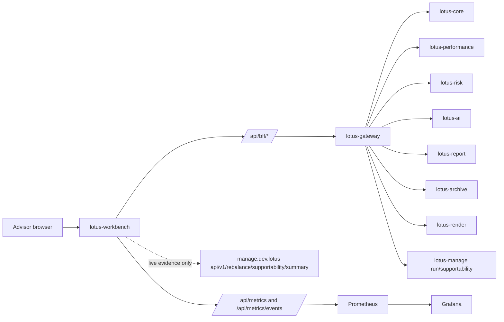

# Observability Evidence

This page defines the repeatable evidence pack for showing functional and non-functional front-office
runtime capabilities from the live canonical stack. It is intended for offline client-demo preparation,
operator onboarding, and future incident-investigation walkthroughs.

## Current Scope

This page governs evidence collection and review for the canonical Workbench runtime. It does not
promote a feature, replace source-service certification, or make screenshots authoritative when
runtime validation fails.

| Reader | Decision | Required Evidence |
| --- | --- | --- |
| Demo and product teams | Is a capture suitable for a supported demonstration? | Passing canonical validation for `PB_SG_GLOBAL_BAL_001` plus a same-run evidence manifest |
| Operations and support | Where should first-response investigation begin? | Readiness, bounded logs, metrics, target posture, and failed API checks from one evidence pack |
| Contract reviewers | Does documented local API behavior match runtime? | Exact route-test parity for metrics ingest and source-owned contracts for Gateway-backed behavior |
| Engineers | Can a change be claimed as implementation-backed? | Repository tests, canonical runtime proof when applicable, and explicit unsupported boundaries |

## Evidence Rule

Run validation first:

```powershell
npm run live:stack:up:validate
```

Only use screenshots as demo-ready evidence after the governed validation passes for
`PB_SG_GLOBAL_BAL_001`. If validation fails, the capture may still be useful for diagnosis, but it
must be described as diagnostic evidence.

## Capture Command

From `lotus-workbench`:

```powershell
npm run live:evidence
```

The command writes a timestamped pack under:

```txt
output/observability-live/<timestamp>/
```

The output directory is intentionally local evidence and should not be committed by default.

## What The Pack Contains

- `observability-evidence-manifest.json`: machine-readable index of everything captured
- `README.md`: human-readable artifact index
- `validation`: manifest section linking the pack to the latest
  `output/playwright/live-canonical/live-validation-summary.json`, its SHA-256, and accepted
  full-profile Idea capacity posture; diagnostic or pending summaries are refused
- `dns.json`: canonical hostname resolution evidence
- `docker-ps.txt` and `docker-ps.json`: live container inventory and health status
- `api/`: readiness, capability, and representative Gateway API outputs
- `metrics/`: Workbench Prometheus text metrics plus Prometheus and Grafana API samples
- `logs/`: bounded container log tails for investigation walkthroughs
- `logs/<current Core derived-state container>.log`: one bounded log tail for both position-timeseries
  materialization and portfolio-timeseries aggregation. The capture resolves
  `portfolio_derived_state_service` from the Core Compose service and verifies the labelled
  checkout. It revalidates the immutable container ID before the log read; replacement, missing,
  foreign, or empty post-capture-start required logs fail the capture instead of producing a
  demo-ready pack with a retired container name. Historical pre-start lines do not satisfy it.
- `screenshots/`: Workbench evidence/risk views plus Prometheus and Grafana screenshots

## Demonstrating Functional Capabilities

Use the API samples to show that the UI is backed by live services rather than static mock data:

- Gateway platform capabilities
- Gateway Workbench overview
- performance summary
- risk summary
- advisor brief
- Manage action-register supportability summary through
  `GET /api/v1/rebalance/supportability/summary`
- Report integration capabilities
- Archive and Render readiness

These files are useful in offline demos because they preserve the actual response shape used by
Workbench and Gateway during the proof run.



The direct Manage probe is an evidence-readiness check, not a product data shortcut. Workbench
product surfaces continue to consume Gateway-shaped contracts. Current `lotus-manage` proof is
limited to strategic run lookup and supportability posture while discretionary mandate management
APIs are being revamped.

## Demonstrating Non-Functional Capabilities

Use the non-functional artifacts to explain how teams operate the stack:

- container inventory proves which apps and support services were live
- readiness samples show health/readiness posture by app
- Workbench `/api/metrics` shows Prometheus-formatted UI observability metrics
- the initial Performance Summary route load emits the same bounded
  `performance.workspace.summary` API, panel-state, and hydration metrics as supported client-side
  refreshes
- Prometheus target and `up` query samples show scrape posture
- Grafana health and screenshots show dashboard entrypoint posture
- bounded log tails show where operators start when investigating Gateway, Workbench, Core,
  Performance, Risk, Manage, Report, Archive, Render, and AI behavior

### Metrics Ingest Response Contract

Workbench authors the accepted and rejected JSON response examples for
`POST /api/metrics/events` in
`docs/operations/metrics-event-response-examples.v1.json`. The route test executes the actual
Next.js handler for every authored case and requires exact status and response-object equality.
Changing a field name, type, value, or presence in either documentation or runtime therefore fails
the test instead of leaving a stale but parseable example.

This evidence covers the local metrics-ingest route only. It is not whole-Workbench endpoint
certification and does not replace live Prometheus, canonical stack, or Gateway contract proof.

## Evidence Quality Checks

Before using a pack in client or operator material, review it for obvious degradation:

- `dns.json` has no `error` entries for canonical `*.dev.lotus` hosts
- API capture records are HTTP `2xx`; Gateway overview has empty `warnings` and
  `partial_failures`
- `api/manage-ready.json` and Manage supportability evidence prove the management backing store is
  ready, not only that `/docs` is reachable
- `metrics/prometheus-targets.json` has active scrape targets without `lastError`
- `logs/*.log` are raw container logs and do not contain PowerShell wrapper markers such as
  `NativeCommandError`, `CategoryInfo`, or `FullyQualifiedErrorId`
- screenshots are paired with `npm run live:stack:up:validate` evidence from the same live stack window
- `observability-evidence-manifest.json` has `validation.summaryAccepted=true`, records the summary
  SHA-256 and accepted capacity status, and separates
  application `apiChecks` from dashboard and metrics `metricChecks`
- canonical screenshots are captured after transient hover overlays are dismissed, so demo packs
  should not contain accidental tooltips or pointer-triggered state

## Performance Trace Review

When reviewing RFC-0108 performance evidence, do not stop at screenshots:

- Workbench BFF logs should include elapsed timing for performance summary, details, attribution
  trend, and related split endpoints.
- Gateway logs should include `analytics_ui.gateway` fanout and audit events with stable
  `correlation_id`, `request_id`, and `trace_id` fields.
- Performance service logs should show the same correlation/trace chain reaching compute events.
- Evidence partial states are valid only when the UI surfaces the partial posture and the payload
  explains the lineage limitation. A pending lineage manifest or lineage lookup `404` may be
  acceptable for the current local canonical stack, but only if the canonical performance route,
  calculations, and validation summary are otherwise green.

## Permission-Blocked Analytics Proof

RFC-0108 entitlement evidence is valid only when the UI, metrics, and logs preserve a bounded
caller-context posture:

- performance Summary initial-load denials should render `Access restricted` with HTTP `401` or
  `403`, not the raw Gateway entitlement response body
- Risk Review denials should render `Risk access restricted` and mark the risk mode status as
  `Access Restricted`
- Advisor Brief denials should classify the advisor brief view model as `permission_blocked` and
  surface `Advisor brief access is restricted` in supportability and exception copy
- Advisor Brief review-action denials should emit bounded Workbench metrics for
  `performance-advisor-brief-review-action` and must not expose the raw Gateway entitlement
  response body, reviewed-by identity, request body, portfolio id, or client id in UI errors or
  metric labels
- Browser-originated review-action metrics should be visible in `/api/metrics` after the
  same-origin `/api/metrics/events` ingest accepts the bounded event. A successful proof should
  show `performance-advisor-brief-review-action` and
  `performance.workspace.advisor-brief.review-action` in Prometheus text while excluding reviewer
  identity, portfolio id, client id, correlation id, and free-form review reason. Review actions
  should emit API request and panel-state metrics, and may emit bounded attention metrics when the
  returned advisor brief is not fully supportable; they must not increment panel hydration metrics
  because no panel hydration occurs during the mutation.
- Workbench analytics metrics should classify denied `401` or `403` reads as
  `permission_blocked`, while still excluding portfolio id, client id, trace id, request body,
  response body, and entitlement-failure text from labels
- Gateway logs should carry the corresponding bounded `analytics_read_denied` audit event with
  correlation and trace identifiers, route/panel/operation, status class, region, and environment

If raw entitlement text appears in screenshots, browser-rendered state, metric labels, or demo
material, treat the pack as failed evidence even if the HTTP denial itself is correct.

Current residual to classify honestly:

- Performance evidence lineage may be reported as partial while lotus-performance materializes
  lineage records. In that state the Workbench evidence panel should show
  `PERFORMANCE_EVIDENCE_PARTIAL`, and bounded logs may include lineage lookup `404` entries. Treat
  that as a known functional residual only when the canonical performance route, Gateway overview,
  and validation summary are otherwise green. It is not acceptable for the pack to contain
  non-canonical portfolio traffic such as `DEMO_ADV_USD_001` during canonical evidence capture.

## Current Gold-Pass Evidence

The 2026-05-02 RFC-0108 Workbench gold-pass run produced these local artifacts:

- canonical validation summary:
  `output/rfc-0108-live-gold-pass-20260502/live-validation-summary.json`
- demo screenshot index:
  `output/rfc-0108-live-gold-pass-20260502/SHOT-INDEX.md`
- observability manifest:
  `output/rfc-0108-live-gold-pass-20260502-observability/observability-evidence-manifest.json`
- observability screenshots:
  `output/rfc-0108-live-gold-pass-20260502-observability/screenshots/`

The canonical validation recorded 24 API checks, 8 UI checks, 7 governed screenshots, 12 panel
classifications, and 4 advisor-brief workflow-pack checks for `PB_SG_GLOBAL_BAL_001` against
`BMK_PB_GLOBAL_BALANCED_60_40`. All application API samples in the companion observability pack
returned HTTP `200`, including Manage readiness and Manage action-register supportability summary.
The canonical Workbench validator records the bounded Manage supportability state and reason as
source-supportability evidence; stale action-register freshness is not treated as DPM panel failure
when command-center, wave, outcome-review, proof-pack, and portfolio-memory contracts are ready.

## Suggested Offline Demo Flow

1. Open the latest `README.md` in `output/observability-live/<timestamp>/`.
2. Start with `docker-ps.txt` to show the canonical runtime topology.
3. Show `api/gateway-workbench-overview.json` and the performance/risk API outputs to connect UI
   behavior to backend contracts.
4. Show `metrics/workbench-api-metrics.prom`, `metrics/prometheus-targets.json`, and the
   Prometheus screenshots for observability posture.
5. Show representative log files from `logs/` to demonstrate how an operator would investigate a
   failed route, stale upstream, or degraded panel.
6. Use live demo only for the areas where the audience wants deeper interaction.

## Current Boundaries

This pack is evidence capture, not production monitoring certification. It demonstrates the
current local canonical stack posture and should be regenerated whenever runtime automation,
service topology, or RFC-0108 observability behavior changes.
