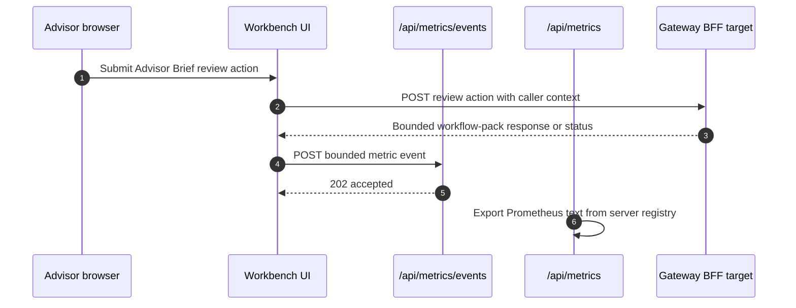

# Operations Runbook

## Current Scope

This runbook covers first-response operation of the canonical local Workbench stack. It does not
replace source-service recovery procedures or turn diagnostic screenshots into release evidence.

| Situation | First Action | Evidence Before Escalation |
| --- | --- | --- |
| Product surface unavailable | Run canonical validation and inspect the failed API/panel check | Validation summary, readiness response, and bounded logs |
| Data appears partial or stale | Inspect Gateway source-supportability and owning-service posture | Correlation-safe API evidence and source freshness state |
| Metrics or dashboards missing | Check Workbench metrics, Prometheus targets, and Grafana health | Same-run evidence pack with target and query results |
| Demo preparation | Validate `PB_SG_GLOBAL_BAL_001` before capture | Passing validation and same-run screenshots/manifest |
| Slow canonical bring-up | Compare unique `runtime-phases-*.json` and `build-plan-*.json` receipts using the [bounded-build runbook](https://github.com/sgajbi/lotus-workbench/blob/main/docs/operations/canonical-front-office-local-runtime.md#bounded-image-construction-and-timing) | Separate build/start, Core materialization, DPM/Idea seed and validation; default remains serial until full measured comparison |
| Core `/version` or OCI revision says `unknown` after a canonical rebuild | Inspect the [exact-source Core build and image check](https://github.com/sgajbi/lotus-workbench/blob/main/docs/operations/canonical-front-office-local-runtime.md#canonical-local-prerequisites) and rerun under the same governed reservation after source repair | A clean Git checkout alone does not qualify the built image; the launcher fails before seeding on metadata mismatch |

## Important operational checks

- use `workbench.dev.lotus` and `gateway.dev.lotus` for canonical product proof
- use seeded portfolio `PB_SG_GLOBAL_BAL_001` unless the slice explicitly targets another dataset
- keep diagnostic screenshots separate from final demo evidence
- validate the canonical stack before treating screenshots as review-ready
- treat capability-disabled shell entries as contract truth, not as something to work around in
  demo documentation

## Practical runtime flow

First acquire Platform's single-workspace reservation with an explicit holder, issue/PR purpose,
UTC expiry and exact resolved source/project/port scope, then set
`LOTUS_CANONICAL_RUNTIME_HOLDER`. Read the
[reservation control](https://github.com/sgajbi/lotus-platform/blob/main/docs/operations/canonical-runtime-reservation.md).
The shipped startup/preflight/teardown refuse missing, foreign, expired or unfinished ownership.
Successful zero-resource teardown releases the machine record; a native failure retains it.
Controlled runner fixtures are not actual supplier acceptance, seed readiness or production IAM.
The selected Workbench checkout must match admission and each executing script before I/O.
Standalone validation holds one operation through DNS/HTTP/evidence/browser execution; nested
validation retains the startup token. Project teardown verifies all current full IDs and exact
checkout metadata before Compose down; already-exited listeners are not teardown failures.
Startup shares the full-ID fence before mutations and checks every Compose down/up, including
environment-scoped AI startup. In-process nested DPM seeding shares its actual live exclusive
original parent FileStream registered to its token in the same module instance and validates the unchanged parent
holder/workspace/selected-checkout/operation token without reacquiring or finishing its lock; ingress
failure stops before seed and remains a failed operation.
Diagnostic `-CoreManageOnly` startup requires explicit `--runtime-mode core-manage` acquisition.
Skipped product checkouts/configuration are not consulted; teardown carries that acquired scope
and its ports, leaving skipped listeners untouched. Partial startup does not invoke full-scope DPM seed.
Full and partial source authority cannot substitute; neither partial proof nor CI certifies Level B.

```powershell
npm run live:stack:up
npm run live:validate
npm run live:evidence
npm run live:stack:down
```

The canonical startup script defaults `lotus-ai` to `.env.example` for deterministic
provider-disabled proof, even if a local `lotus-ai/.env` asks for a live or local provider. Pass
`-LotusAiEnvFile .env` only when the required provider dependency is intentionally running.

Docker is the default runtime for the canonical front-office app set: Workbench, Gateway, Core,
Performance, Risk, Advise, Manage, Report, Archive, Render, and AI. For active RFC development,
use `-LocalApps` to replace selected Docker-backed apps with same-port local processes while
keeping canonical hostnames and validation evidence stable. The common Workbench UI path is:

```powershell
npm run live:stack:up:workbench-local
```

## Browser-facing probes

```txt
http://workbench.dev.lotus/portfolio
http://workbench.dev.lotus/performance?portfolioId=PB_SG_GLOBAL_BAL_001
http://workbench.dev.lotus/performance?portfolioId=PB_SG_GLOBAL_BAL_001&mode=risk
```

## Runtime health and replica posture

| Endpoint or input | Operational meaning | Do not infer |
| --- | --- | --- |
| `/api/health/live` | The Workbench process can serve HTTP | Gateway or source-service readiness |
| `/api/health/ready` | The embedded build identity matches the runtime deployment identity, and Gateway address plus request timeout are valid | End-to-end product health or source freshness |
| `WORKBENCH_DEPLOYMENT_ID` | All replicas in one rollout cohort serve the same deterministic deployment identity | A release is approved or production-certified |

Gateway degradation remains visible through bounded BFF failures and panel recovery. Do not remove
an otherwise healthy Workbench shell replica solely because a downstream dependency is degraded,
and do not replace a truthful downstream failure with a green readiness response or user success
message.

For an isolated statelessness and replica-replacement regression, run:

```powershell
npm run scale:proof
```

The command uses a separate Compose project, two copies of one immutable Workbench image, a pinned
stable NGINX validation balancer without affinity, and a non-business source fixture. It writes
machine-readable and reviewable evidence under `output/scale-proof/` and tears down its own
containers. It stops and removes one Workbench container, creates a replacement, and fails unless
the replacement has a different container identity before recovery traffic is accepted. The
harness is safe to use without disturbing the canonical front-office stack, but it
is not production topology, load/soak, high-availability, disaster-recovery, identity, or bank
capacity certification.

## Analytics UI observability posture

- RFC-0108 analytics UI observability vocabulary is code-owned in
  `src/features/analytics-observability/contract.ts`.
- Workbench emits local analytics UI metric events for the supported Portfolio workspace,
  client-side Performance summary, Performance details, horizon comparison, attribution trend,
  advisor brief, advisor brief review actions, Risk summary, Risk concentration, Risk drawdown,
  Risk rolling, Risk attribution, and explicit report-batch operator reads through
  `src/features/analytics-observability/metrics.ts`.
- Workbench emits bounded local attention events and the
  `lotus_analytics_ui_attention_events_total` counter for stale, degraded, partial-source, and
  repeated-failure states on those selected analytics panels. Attention labels are deduplicated and
  limited to governed route, panel, service, operation, state, reason, freshness, supportability,
  attention type, and severity fields.
- Workbench derives supported-read support state from source-shaped metadata such as
  `supportability.state`, `supportability.freshness_bucket`, supportability item arrays, and
  Gateway `source_supportability` arrays before recording panel state, hydration, and attention
  metrics. Any stale source supportability item takes precedence over fresh source items so stale
  upstream posture cannot be hidden by another ready source.
- `/api/metrics` exposes the implemented Workbench analytics UI metric families in Prometheus text
  format for platform scrape and dashboard/alert contracts.
- Client-side Workbench actions, including Advisor Brief review transitions, publish only bounded
  analytics metric events back to `/api/metrics/events`; the server-side metrics registry then
  exposes them through `/api/metrics`. This keeps mutation observability visible to Prometheus
  without accepting raw request bodies, response bodies, portfolio ids, client ids, correlation ids,
  or reviewer identity as labels. State-changing actions are intentionally excluded from panel
  hydration histograms because the action observes a mutation result rather than a panel load.
- Do not add panel, route, or browser telemetry labels outside that contract.
- `portfolio_id`, `client_id`, `client_name`, `holding_id`, `transaction_id`, `document_id`,
  `batch_id`, `report_job_id`, `session_id`, `trace_id`, `correlation_id`, request bodies,
  response bodies, and screen content must not become metric labels or browser event fields.
- Gateway or BFF mutation failures should surface bounded status-class posture only. Review-action
  and report-batch failures must not copy raw upstream problem details or entitlement text into UI
  error messages or metric labels.
- Canonical browser proof for the supported Slice 14 Portfolio, Performance, Risk, and
  report-batch reads has passed for `PB_SG_GLOBAL_BAL_001`; full RFC-0079 risk/evidence scope
  remains governed by later RFC-0108 evidence. The performance evidence surface now renders
  Gateway-backed RFC-0079 product context for as-of date, period, basis, benchmark, source services,
  freshness, methodology, calculation versions, coverage, fallbacks, and limitations where the
  Gateway evidence contract provides it. Canonical validation records `supportabilityChecks` for
  Gateway `source_supportability` evidence on performance and risk payloads.
- The report-batch operations panel includes a Gateway-backed archived document lookup for
  operator retrieval. Metadata reads use `/api/bff/api/v1/documents/{document_id}?current=true`,
  downloads use `/api/bff/api/v1/documents/{document_id}/download`, and the shared BFF proxy
  preserves binary PDF payloads plus checksum/content-disposition headers.
- Canonical live validation checks `lotus-manage` supportability through
  `GET /api/v1/rebalance/supportability/summary`. The deprecated
  [Manage integration-capabilities probe](http://manage.dev.lotus/integration/capabilities) is not
  valid evidence for the current Manage boundary.



## Output paths

- screenshots and summary:
  `output/playwright/live-canonical/`
- machine-readable summary:
  `output/playwright/live-canonical/live-validation-summary.json`
- observability and operations evidence:
  `output/observability-live/<timestamp>/`

## Review-ready evidence

- use canonical validated captures for demos, PR review, and operator handoff
- keep pre-validation captures clearly labeled as diagnostic artifacts only
- when a route exists but is capability-disabled, capture the supported active path instead of the
  dormant compatibility page
- review screenshots manually for accidental hover state, clipped labels, or overlapping content
  before using them in client material; the validator clears transient hover state before each
  governed screenshot, but human review remains part of the gold-pass bar

## Observability evidence capture

After `npm run live:validate` passes, capture an operations-oriented evidence pack:

```powershell
npm run live:evidence
```

The pack includes hostname resolution, container inventory, readiness and representative API
outputs, Workbench Prometheus metrics, Prometheus/Grafana API samples, bounded container log tails,
and screenshots for Workbench evidence views plus Prometheus/Grafana entrypoints. Use this pack for
offline client-demo preparation and operational documentation. It complements
`live-validation-summary.json`; it does not replace the governed validation gate.

## Key references

- [docs/operations/canonical-front-office-local-runtime.md](https://github.com/sgajbi/lotus-workbench/blob/main/docs/operations/canonical-front-office-local-runtime.md)
- [docs/demo/README.md](https://github.com/sgajbi/lotus-workbench/blob/main/docs/demo/README.md)
- [docs/architecture/workbench-scalability-and-availability-decision.md](https://github.com/sgajbi/lotus-workbench/blob/main/docs/architecture/workbench-scalability-and-availability-decision.md)
